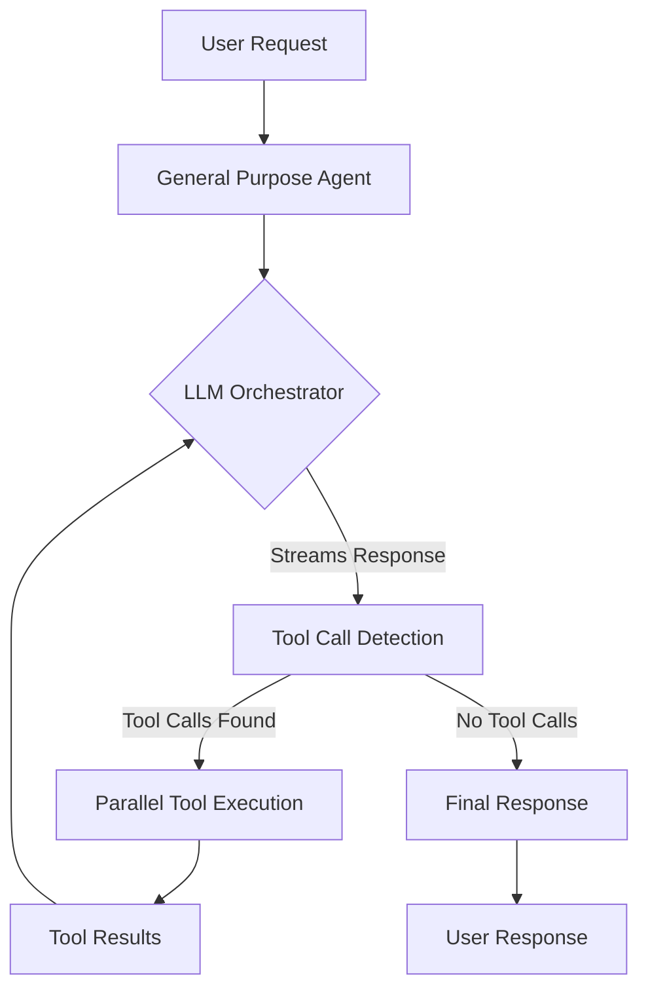
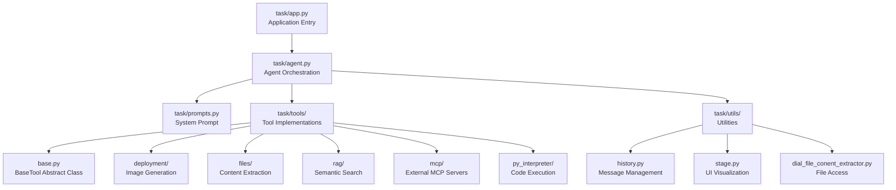

# DIAL General Purpose Agent

A sophisticated AI agent built on the [DIAL Platform](https://dialx.ai) that orchestrates multiple AI capabilities through an LLM-powered tool execution framework.

## 📋 Table of Contents

- [Overview](#overview)
- [Key Features](#key-features)
- [Quick Start](#quick-start)
- [Architecture](#architecture)
- [Documentation Structure](#documentation-structure)
- [Getting Help](#getting-help)

## Overview

The **General Purpose Agent** is an implementation of the Agent-as-Orchestrator pattern that uses Large Language Models (GPT-4o, Claude Sonnet 3.7) to intelligently decide when and how to use specialized tools. The agent seamlessly integrates:

- **Web Search** via DuckDuckGo MCP server
- **Python Code Execution** via stateful Jupyter kernel (MCP)
- **RAG (Retrieval Augmented Generation)** for semantic document search
- **Image Generation** via DALL-E-3
- **File Content Extraction** for PDF, TXT, CSV, HTML files

### Agent-as-Orchestrator Pattern



## Key Features

### 🔍 Multi-Source Information Retrieval
- DuckDuckGo web search for current information
- Semantic search over uploaded documents (FAISS + SentenceTransformers)
- Efficient pagination for large file extraction

### 🐍 Code Execution
- Stateful Python interpreter (Jupyter kernel)
- Data analysis and visualization capabilities
- Chart generation (matplotlib, seaborn)
- Maintains session state across executions

### 🎨 Creative Tools
- DALL-E-3 image generation
- Prompt enhancement and optimization
- Direct file attachment in responses

### 📄 Document Processing
- Multi-format support: PDF, TXT, CSV, HTML
- Smart pagination (10KB chunks)
- RAG-based semantic search for large documents

### 🔐 Security & Performance
- Per-request API key forwarding (user's own credentials)
- Hidden conversation state management
- Conversation-scoped document caching (24h TTL)
- Async tool execution with error isolation

## Quick Start

### Prerequisites
- Python 3.12
- Docker & Docker Compose
- DIAL API key (EPAM AI Proxy access)

### 5-Minute Setup

```bash
# 1. Clone repository
cd /path/to/ai-dial-general-purpose-agent

# 2. Activate virtual environment
source dial_general_agent/bin/activate

# 3. Set API key
export DIAL_API_KEY="your-api-key"

# 4. Start infrastructure
docker-compose up -d

# 5. Run agent
python -m task.app

# 6. Open browser
# Navigate to http://localhost:3000
```

**Test the agent:**
1. Open DIAL Chat at http://localhost:3000
2. Select "General Purpose Agent" from marketplace
3. Ask: "What can you do?"

See [setup.md](./setup.md) for detailed installation instructions.

## Architecture

The agent follows a recursive streaming pattern:

1. **Request Reception** → User message + attachments
2. **Message Preparation** → Inject system prompt + unpack state
3. **LLM Streaming** → Accumulate content + tool calls by index
4. **Tool Execution** → Parallel async execution with stage visualization
5. **Recursive Call** → Append results to state and recurse
6. **Final Response** → Stream back to user when no tool calls remain

### Core Components



**Key Files:**
- [task/app.py](../task/app.py) - Application entry point, lazy tool initialization
- [task/agent.py](../task/agent.py) - Recursive orchestration loop
- [task/tools/base.py](../task/tools/base.py) - Template method pattern for tools
- [task/prompts.py](../task/prompts.py) - System prompt with reasoning guidelines

See [architecture.md](./architecture.md) for in-depth system design.

## Documentation Structure

| Document | Purpose | Target Audience |
|----------|---------|-----------------|
| [README.md](./README.md) | Overview & quick start | All users, new developers |
| [architecture.md](./architecture.md) | System design, patterns, data flow | Software architects, senior devs |
| [api.md](./api.md) | Public interfaces, classes, endpoints | Integration developers |
| [setup.md](./setup.md) | Environment setup, configuration | DevOps, developers |
| [testing.md](./testing.md) | Test scenarios, validation | QA, developers |
| [glossary.md](./glossary.md) | Domain terms, abbreviations | All users |
| [roadmap.md](./roadmap.md) | Future plans, milestones | Product managers, stakeholders |
| [adr/](./adr/) | Architecture Decision Records | Technical leads, architects |

## Technology Stack

### Core Framework
- **aidial-sdk** (0.27.0) - DIAL Platform integration
- **aidial-client** (0.3.0) - DIAL API client
- **mcp** (1.17.0) - Model Context Protocol for external tools

### AI/ML Components
- **sentence-transformers** (5.1.1) - Text embeddings for RAG
- **faiss-cpu** (≥1.12.0) - Vector similarity search
- **langchain** (1.0.3) - Document processing utilities

### Document Processing
- **pdfplumber** (0.11.7) - PDF text extraction
- **beautifulsoup4** (4.14.2) - HTML parsing
- **pandas** (2.3.3) - CSV/data handling

### Infrastructure
- **uvicorn** - ASGI server (port 5030)
- **Docker Compose** - Multi-container orchestration
- **Redis** - Caching layer (port 6379)

## Project Structure

```
ai-dial-general-purpose-agent/
├── task/                          # Main application code
│   ├── app.py                     # Application entry point
│   ├── agent.py                   # Agent orchestration logic
│   ├── prompts.py                 # System prompt definitions
│   ├── tools/                     # Tool implementations
│   │   ├── base.py                # BaseTool abstract class
│   │   ├── deployment/            # DIAL deployment tools
│   │   ├── files/                 # File extraction tools
│   │   ├── mcp/                   # MCP client & tool wrappers
│   │   ├── py_interpreter/        # Python code execution
│   │   └── rag/                   # RAG search implementation
│   └── utils/                     # Helper utilities
├── core/                          # DIAL Core configuration
│   └── config.json                # Models, applications, keys
├── docs/                          # Documentation (this directory)
├── tests/                         # Test files & fixtures
├── docker-compose.yml             # Infrastructure definition
├── requirements.txt               # Python dependencies
└── README.md                      # Project introduction
```

## Getting Help

### Common Issues

**Agent not responding:**
- Check DIAL Core is running: `docker-compose ps`
- Verify agent is running: `curl http://localhost:5030/health`
- Check API key is set: `echo $DIAL_API_KEY`

**Tool execution errors:**
- View container logs: `docker-compose logs ddg-search python-interpreter`
- Check MCP servers: `curl http://localhost:8051/health`
- Review agent logs in terminal where `python -m task.app` is running

**File extraction issues:**
- Verify file type is supported in [core/config.json](../core/config.json) `inputAttachmentTypes`
- Check file size (10KB pagination chunks)
- Try RAG search for large documents instead of full extraction

### Resources

- **DIAL Platform Documentation**: https://docs.dialx.ai
- **MCP Protocol Specification**: https://github.com/modelcontextprotocol/specification
- **DIAL SDK Reference**: https://github.com/epam/ai-dial-sdk
- **Example Projects**: https://github.com/epam/ai-dial

### Troubleshooting Steps

1. **Verify infrastructure:**
   ```bash
   docker-compose ps
   # All services should show "Up"
   ```

2. **Test DIAL Core:**
   ```bash
   curl http://localhost:8080/health
   ```

3. **Test agent endpoint:**
   ```bash
   curl http://localhost:5030/health
   ```

4. **Test MCP servers:**
   ```bash
   curl http://localhost:8051/health  # DuckDuckGo search
   curl http://localhost:8050/health  # Python interpreter
   ```

5. **Check logs:**
   ```bash
   docker-compose logs -f core       # DIAL Core logs
   docker-compose logs -f ddg-search # Search server logs
   # Agent logs in terminal where app.py runs
   ```

## Contributing

This is an educational project demonstrating agent orchestration patterns. For production use, consider:

- Adding authentication/authorization layers
- Implementing rate limiting for tool execution
- Adding comprehensive error recovery
- Setting up monitoring and observability
- Implementing conversation persistence
- Adding multi-user conversation isolation

See [roadmap.md](./roadmap.md) for planned enhancements.

## License

TODO: Specify license information

## Support

For questions or issues:
1. Check [troubleshooting section](#getting-help)
2. Review [architecture documentation](./architecture.md)
3. Consult [DIAL Platform docs](https://docs.dialx.ai)
4. Contact EPAM AI/ML team

---

**Next Steps:**
- [Setup Guide](./setup.md) - Detailed installation instructions
- [Architecture](./architecture.md) - System design deep dive
- [API Reference](./api.md) - Public interfaces and classes
