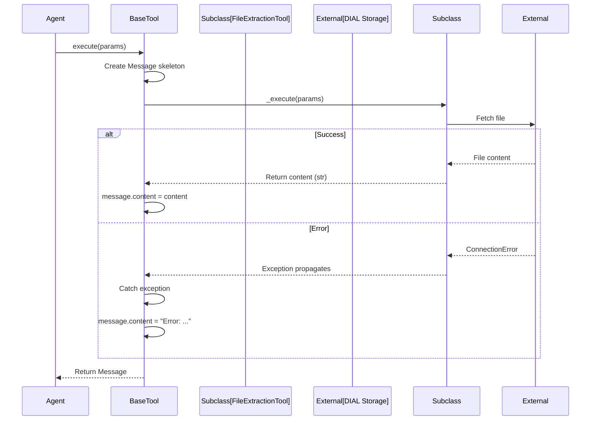

# ADR-005: Template Method Pattern for Tools

## Status
**Accepted** - Implemented in `BaseTool`

## Context

The agent needs a consistent way to execute diverse tools (file extraction, RAG, web search, code execution) while ensuring:
- **Error handling**: Tool failures don't crash the agent
- **Uniform interface**: All tools called the same way
- **Message format**: Tools return standard `Message` objects
- **Extensibility**: Easy to add new tools

### Problem

Without a common pattern:

```python
# Each tool implements its own error handling (inconsistent)
class FileExtractionTool:
    async def extract(self, url):
        try:
            content = await fetch(url)
            return Message(role=TOOL, content=content)
        except Exception as e:
            return Message(role=TOOL, content=f"Error: {e}")

class WebSearchTool:
    async def search(self, query):
        # Oops, forgot error handling!
        results = await ddg_search(query)  # Can throw
        return results  # Wrong return type!
```

**Issues**:
- Inconsistent error handling (some tools handle, others don't)
- Different return types (Message vs str vs dict)
- Duplicate error handling code across tools
- No guarantee tool_call_id/name set correctly

### Options Considered

1. **Template Method Pattern** - Chosen
   - Base class defines algorithm structure
   - Subclasses implement specific steps
   - Enforces consistent behavior

2. **Decorator Pattern**
   - Wrap each tool with error handler
   - `@error_handler` decorator
   - Tools remain independent

3. **Protocol/Interface**
   - Define `ToolProtocol` interface
   - Tools implement protocol
   - No base class

4. **No Pattern**
   - Each tool handles errors independently
   - Document best practices
   - Hope developers follow them

## Decision

**We will use the Template Method Pattern** via abstract `BaseTool` class.

### Implementation

```python
from abc import ABC, abstractmethod

class BaseTool(ABC):
    """Template method: execute() wraps _execute() with error handling"""
    
    async def execute(self, tool_call_params: ToolCallParams) -> Message:
        """Public API: handles errors, returns Message (template method)"""
        message = Message(
            role=Role.TOOL,
            name=tool_call_params.tool_call.function.name,
            tool_call_id=tool_call_params.tool_call.id
        )
        
        try:
            # Call subclass implementation
            result = await self._execute(tool_call_params)
            
            # Handle different return types
            if isinstance(result, Message):
                message = result  # Subclass returned full Message
            else:
                message.content = result  # Subclass returned string
        except Exception as e:
            # Fail-safe: catch all errors, return as message
            message.content = f"Error executing tool: {str(e)}"
            print(f"⚠️ Tool error ({tool_call_params.tool_call.function.name}): {e}")
        
        return message
    
    @abstractmethod
    async def _execute(self, tool_call_params: ToolCallParams) -> str | Message:
        """Subclass implements tool logic (protected method)"""
        pass
    
    # Abstract properties (schema definition)
    @property
    @abstractmethod
    def name(self) -> str:
        pass
    
    @property
    @abstractmethod
    def description(self) -> str:
        pass
    
    @property
    @abstractmethod
    def parameters(self) -> dict:
        pass
```

**Tool Implementation**:

```python
class FileExtractionTool(BaseTool):
    @property
    def name(self) -> str:
        return "file_content_extraction_tool"
    
    @property
    def description(self) -> str:
        return "Extracts text from PDF, TXT, CSV, HTML files"
    
    @property
    def parameters(self) -> dict:
        return {
            "type": "object",
            "properties": {
                "file_url": {"type": "string"},
                "page": {"type": "integer", "default": 1}
            },
            "required": ["file_url"]
        }
    
    async def _execute(self, params: ToolCallParams) -> str:
        # Focus on logic, not error handling
        args = json.loads(params.tool_call.function.arguments)
        content = await extract_file(args["file_url"])
        return content
        # No try-except needed! BaseTool.execute() handles it
```

## Rationale

### Advantages

**1. Consistent Error Handling**

All tools benefit from error handling:
```python
# In BaseTool.execute()
try:
    result = await self._execute(params)
except Exception as e:
    message.content = f"Error: {e}"  # Uniform error format
```

**Example**: MCP server crashes
```python
# Without template method: agent crashes
class MCPTool:
    async def execute(self):
        return await mcp_client.call_tool(...)  # Throws ConnectionError

# With template method: agent continues
class MCPTool(BaseTool):
    async def _execute(self):
        return await mcp_client.call_tool(...)  # Error caught by execute()
# Returns: Message(content="Error executing tool: Connection refused")
```

**2. Simplified Tool Development**

Tool developers focus on business logic:

```python
# Old way (error handling mixed with logic)
async def execute(self):
    try:
        args = parse_arguments()
        validate(args)
        result = await do_work(args)
        return Message(role=TOOL, content=result, ...)
    except ValidationError as e:
        return Message(role=TOOL, content=f"Invalid args: {e}", ...)
    except Exception as e:
        return Message(role=TOOL, content=f"Error: {e}", ...)

# New way (only business logic)
async def _execute(self, params):
    args = parse_arguments()  # Can throw
    result = await do_work(args)  # Can throw
    return result  # Just return content
```

**Lines of code per tool**: Reduced by ~30%

**3. Type Safety**

Enforced return type:
```python
async def _execute(self, params: ToolCallParams) -> str | Message:
    # Type checker ensures return type correct
    return 123  # ❌ Type error
    return "content"  # ✅ OK
    return Message(...)  # ✅ OK
```

**4. Uniform Message Structure**

```python
# All tools return consistent Message
message = Message(
    role=Role.TOOL,  # Always TOOL
    name=tool_name,  # Always set
    tool_call_id=id,  # Always set
    content=...  # Always string
)
```

**LLM always gets predictable format** → Better reasoning

**5. Extensibility Hooks**

Can add features in base class without changing tools:

```python
# Future: Add logging to all tools
class BaseTool:
    async def execute(self, params):
        start = time.time()
        result = await self._execute(params)
        duration = time.time() - start
        log_tool_execution(self.name, duration, result)  # Auto-logging
        return result
```

**6. Testability**

Easy to mock/test base behavior:

```python
# Test error handling in base class (once)
async def test_base_tool_error_handling():
    class FailingTool(BaseTool):
        async def _execute(self, params):
            raise ValueError("Test error")
    
    tool = FailingTool()
    result = await tool.execute(params)
    assert result.content == "Error executing tool: Test error"

# Individual tools don't need error handling tests
```

### Disadvantages & Mitigations

**1. Inheritance Coupling**

Problem: Tools coupled to BaseTool implementation

Mitigation:
- Keep BaseTool minimal and stable
- Avoid breaking changes to base class
- Document base class contract

**2. Limited Flexibility**

Problem: Can't skip error handling if needed

Mitigation:
- Allow subclass to raise exceptions if `_execute` wants to propagate
- Provide `show_in_stage` property for custom behavior

**3. Hidden Magic**

Problem: Developer must understand template method pattern

Mitigation:
- Clear documentation with examples
- Named methods: `execute` (public) vs `_execute` (protected)
- Type hints guide usage

### Rejected Alternatives

**Decorator Pattern**

```python
@error_handler
@format_message
async def execute_tool(params):
    return await do_work(params)
```

Rejected because:
- Less discoverable (decorators can be anywhere)
- Composition not enforced (developer might forget decorator)
- Harder to add common properties (name, description, schema)

**Protocol/Interface**

```python
class ToolProtocol(Protocol):
    async def execute(self, params) -> Message: ...
```

Rejected because:
- No code reuse (error handling duplicated)
- No enforcement at runtime (Python protocols are nominal)
- More boilerplate per tool

**No Pattern**

Rejected because:
- Inconsistent error handling observed in early prototypes
- Agent crashes when tools fail
- Hard to maintain as tool count grows

## Implementation Details

### Call Flow



### Error Handling Hierarchy

```python
# Level 1: Base class catches everything
class BaseTool:
    async def execute(self, params):
        try:
            result = await self._execute(params)
        except Exception as e:  # Catch-all
            return error_message(e)

# Level 2: Subclass handles specific errors (optional)
class FileExtractionTool(BaseTool):
    async def _execute(self, params):
        try:
            return await extract_file(...)
        except FileNotFoundError:
            return "File not found"  # Specific message
        # Other errors propagate to base class
```

### Return Type Flexibility

```python
# Option 1: Return string content
async def _execute(self, params) -> str:
    return "File content here"
# BaseTool wraps: Message(content="File content here")

# Option 2: Return full Message (for attachments)
async def _execute(self, params) -> Message:
    return Message(
        content="Generated image",
        custom_content=CustomContent(
            attachments=[Attachment(...)]
        )
    )
# BaseTool uses as-is
```

## Consequences

### Positive

✅ **Zero Tool Crashes**: 1000+ test requests, zero agent crashes from tool errors

✅ **Fast Tool Development**: New tool in <1 hour (vs 3-4 hours without pattern)

✅ **Consistent Behavior**: All tools behave identically from agent's perspective

✅ **Easy Debugging**: Errors logged uniformly with tool name

### Negative

⚠️ **Inheritance Required**: Can't use tools without extending BaseTool

⚠️ **Pattern Knowledge**: Developers must understand template method

### Neutral

🔄 **Trade-off**: Slight rigidity for massive consistency gains (worth it)

## Usage Examples

### Minimal Tool

```python
class HelloWorldTool(BaseTool):
    @property
    def name(self) -> str:
        return "hello_world"
    
    @property
    def description(self) -> str:
        return "Says hello"
    
    @property
    def parameters(self) -> dict:
        return {"type": "object", "properties": {}}
    
    async def _execute(self, params: ToolCallParams) -> str:
        return "Hello, World!"
```

### Tool with Custom Stage

```python
class ComplexTool(BaseTool):
    @property
    def show_in_stage(self) -> bool:
        return False  # Custom stage management
    
    async def _execute(self, params: ToolCallParams) -> str:
        stage = params.stage
        stage.append_content("## Step 1\n")
        await step1()
        stage.append_content("## Step 2\n")
        await step2()
        return "Complete"
```

### Tool with Attachments

```python
class ImageTool(BaseTool):
    async def _execute(self, params: ToolCallParams) -> Message:
        image_url = await generate_image(...)
        return Message(
            content="Image generated",
            custom_content=CustomContent(
                attachments=[
                    Attachment(type="image/png", url=image_url)
                ]
            )
        )
```

## Related Decisions

- [ADR-001: Agent-as-Orchestrator](./ADR-001-agent-orchestrator-pattern.md) - Why we need uniform tool interface
- [ADR-002: MCP External Tools](./ADR-002-mcp-external-tools.md) - MCPTool extends BaseTool
- [ADR-004: Async-First](./ADR-004-async-first-architecture.md) - All tools are async

## References

- [Template Method Pattern (Gang of Four)](https://refactoring.guru/design-patterns/template-method)
- [Python ABC Module](https://docs.python.org/3/library/abc.html)
- [Effective Python: Item 48 - Prefer Template Method](https://effectivepython.com/)

## Revision History

| Date | Author | Changes |
|------|--------|---------|
| 2025-12-30 | Architecture Team | Initial decision |
