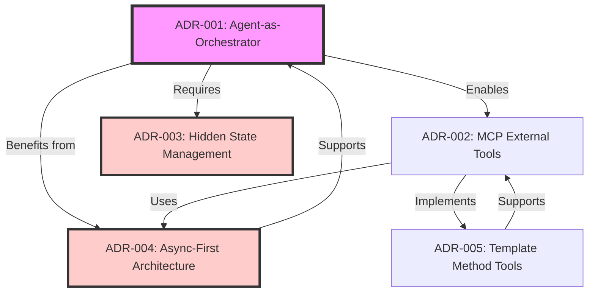
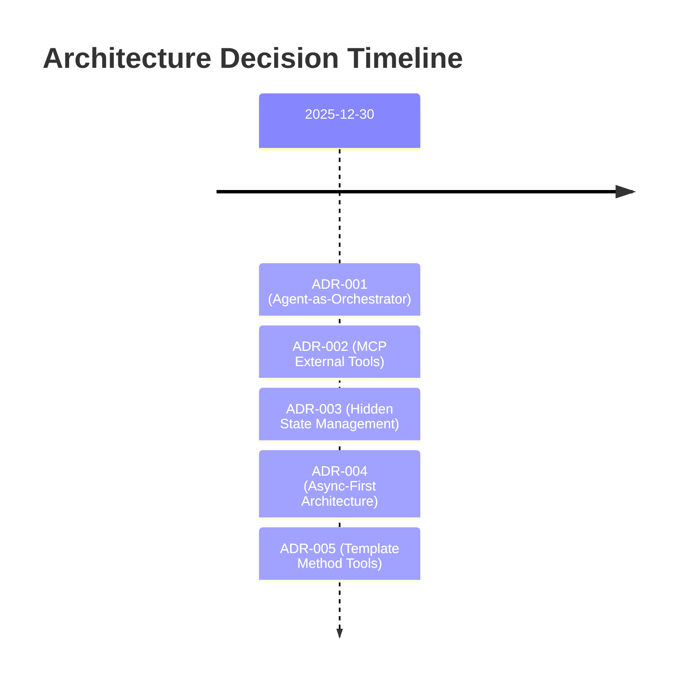

# Architecture Decision Records

This directory contains Architecture Decision Records (ADRs) documenting significant architectural choices made during the development of the DIAL General Purpose Agent.

## What is an ADR?

An Architecture Decision Record captures:
- **Context**: Why we needed to make a decision
- **Decision**: What we decided to do
- **Rationale**: Why this was the best choice
- **Consequences**: Trade-offs and impacts
- **Alternatives**: What we considered and rejected

## ADR Index

### Core Patterns

| ADR | Title | Status | Date | Priority |
|-----|-------|--------|------|----------|
| [ADR-001](./ADR-001-agent-orchestrator-pattern.md) | Agent-as-Orchestrator Pattern | ✅ Accepted | 2025-12-30 | **Critical** |
| [ADR-005](./ADR-005-template-method-tools.md) | Template Method Pattern for Tools | ✅ Accepted | 2025-12-30 | **High** |

### Integration & Interfaces

| ADR | Title | Status | Date | Priority |
|-----|-------|--------|------|----------|
| [ADR-002](./ADR-002-mcp-external-tools.md) | MCP for External Tools | ✅ Accepted | 2025-12-30 | **High** |

### Security & State Management

| ADR | Title | Status | Date | Priority |
|-----|-------|--------|------|----------|
| [ADR-003](./ADR-003-hidden-state-management.md) | Hidden State Management for Security | ✅ Accepted | 2025-12-30 | **Critical** |

### Performance & Scalability

| ADR | Title | Status | Date | Priority |
|-----|-------|--------|------|----------|
| [ADR-004](./ADR-004-async-first-architecture.md) | Async-First Architecture | ✅ Accepted | 2025-12-30 | **Critical** |

## ADR Status Definitions

| Status | Meaning | Symbol |
|--------|---------|--------|
| **Proposed** | Under discussion, not yet decided | 🟡 |
| **Accepted** | Decision made and implemented | ✅ |
| **Deprecated** | No longer recommended, kept for history | ⚠️ |
| **Superseded** | Replaced by a newer ADR | 🔄 |
| **Rejected** | Considered but not chosen | ❌ |

## Decision Dependency Graph



**Legend**:
- 🟪 **Purple**: Core architectural pattern (foundation)
- 🟥 **Red**: Critical supporting decisions (security, performance)
- 🟦 **Blue**: Implementation patterns

## Key Decisions by Category

### 🎯 Core Architecture

**[ADR-001: Agent-as-Orchestrator Pattern](./ADR-001-agent-orchestrator-pattern.md)**
- **Decision**: Use LLM as orchestration engine for tool selection
- **Why**: Flexibility, natural language understanding, error recovery
- **Impact**: Enables complex multi-step workflows without hardcoded logic

**[ADR-003: Hidden State Management](./ADR-003-hidden-state-management.md)**
- **Decision**: Hide tool calls and system prompt from users
- **Why**: Security (prevent prompt injection), clean UX
- **Impact**: Requires state management complexity

### ⚡ Performance

**[ADR-004: Async-First Architecture](./ADR-004-async-first-architecture.md)**
- **Decision**: Use async/await for all I/O operations
- **Why**: 10-100x better scalability, parallel tool execution
- **Impact**: All code must be async-compatible

### 🔌 Integration

**[ADR-002: MCP for External Tools](./ADR-002-mcp-external-tools.md)**
- **Decision**: Use Model Context Protocol for external tool servers
- **Why**: Standardization, isolation, polyglot support
- **Impact**: Additional infrastructure (MCP servers)

### 🛠️ Implementation Patterns

**[ADR-005: Template Method for Tools](./ADR-005-template-method-tools.md)**
- **Decision**: Base class with template method for consistent tool behavior
- **Why**: Uniform error handling, simplified development
- **Impact**: All tools must extend BaseTool

## Decision Timeline



## Quick Reference

### When to Use Each ADR

**Planning New Features?**
- Read [ADR-001](./ADR-001-agent-orchestrator-pattern.md) to understand orchestration flow
- Consider [ADR-002](./ADR-002-mcp-external-tools.md) for external integrations

**Building New Tools?**
- Follow [ADR-005](./ADR-005-template-method-tools.md) template method pattern
- Use [ADR-004](./ADR-004-async-first-architecture.md) async patterns

**Security Review?**
- Check [ADR-003](./ADR-003-hidden-state-management.md) state isolation
- Verify per-request API key forwarding

**Performance Optimization?**
- Apply [ADR-004](./ADR-004-async-first-architecture.md) async patterns
- Review parallel execution opportunities

## Future ADRs (Planned)

| ID | Title | Priority | Target Date |
|----|-------|----------|-------------|
| ADR-006 | Conversation Persistence Strategy | Medium | Q1 2026 |
| ADR-007 | Rate Limiting Implementation | High | Q1 2026 |
| ADR-008 | Monitoring & Observability Stack | Medium | Q2 2026 |
| ADR-009 | Multi-Agent Orchestration | High | Q3 2026 |
| ADR-010 | Tool Marketplace Architecture | Medium | Q4 2026 |

## How to Propose a New ADR

1. **Copy Template**:
   ```bash
   cp docs/adr/ADR-TEMPLATE.md docs/adr/ADR-XXX-short-title.md
   ```

2. **Fill Sections**:
   - Context: Why is this decision needed?
   - Decision: What are we choosing?
   - Rationale: Why is this the best option?
   - Consequences: What are the trade-offs?

3. **Review Process**:
   - Draft → Team Review → Stakeholder Approval → Accepted
   - Minimum 2 developer reviews required
   - Architecture team final approval

4. **Update Index**:
   - Add to this file
   - Update dependency graph
   - Link related ADRs

## ADR Maintenance

- **Review Quarterly**: Check if decisions still valid
- **Update Status**: Mark deprecated/superseded as needed
- **Document Changes**: Add revision history to each ADR
- **Keep History**: Never delete ADRs (mark as superseded instead)

## Related Documentation

- [Architecture Overview](../architecture.md) - See decisions in context
- [API Reference](../api.md) - Implementation details
- [Roadmap](../roadmap.md) - Future decisions needed

---

**Questions about ADRs?**
- See [Architecture Team](mailto:architecture-team@example.com)
- Open issue with `[ADR Question]` tag
- Review existing ADRs for patterns
