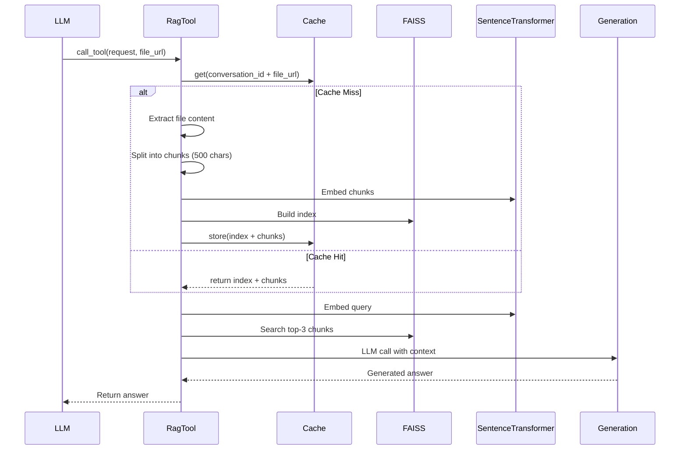

# API Reference

## Table of Contents

- [Core Classes](#core-classes)
- [Tool Interfaces](#tool-interfaces)
- [Utility Classes](#utility-classes)
- [Data Models](#data-models)
- [DIAL Endpoints](#dial-endpoints)
- [MCP Integration](#mcp-integration)

## Core Classes

### GeneralPurposeAgent

**Module**: `task.agent`

Orchestrates multi-turn conversations with tool execution through recursive streaming pattern.

#### Class Definition

```python
class GeneralPurposeAgent:
    def __init__(
        self,
        endpoint: str,
        system_prompt: str,
        tools: list[BaseTool]
    )
```

#### Constructor Parameters

| Parameter | Type | Description |
|-----------|------|-------------|
| `endpoint` | `str` | DIAL Core API endpoint (e.g., `http://localhost:8080`) |
| `system_prompt` | `str` | System prompt injected per-request (hidden from user) |
| `tools` | `list[BaseTool]` | List of available tools for agent |

#### Attributes

| Attribute | Type | Description |
|-----------|------|-------------|
| `endpoint` | `str` | DIAL API endpoint |
| `system_prompt` | `str` | System prompt for LLM guidance |
| `tools` | `list[BaseTool]` | Registered tools |
| `_tools_dict` | `dict[str, BaseTool]` | O(1) lookup map: name → tool |
| `state` | `dict` | Hidden conversation state with `TOOL_CALL_HISTORY_KEY` |

#### Methods

##### `handle_request()`

Main orchestration loop for streaming responses and tool execution.

```python
async def handle_request(
    deployment_name: str,
    choice: Choice,
    request: Request,
    response: Response
) -> Message
```

**Parameters:**
- `deployment_name` - LLM model name (e.g., `gpt-4o`, `claude-sonnet-3-7`)
- `choice` - DIAL Choice object for streaming content to UI
- `request` - DIAL Request with messages, headers (API key), attachments
- `response` - DIAL Response object (unused, required by SDK interface)

**Returns:** Final assistant message with `role=ASSISTANT`

**Flow:**
1. Create `AsyncDial` client with per-request API key
2. Stream chat completion with tool schemas
3. Accumulate streaming `tool_calls` by index
4. If `tool_calls` present:
   - Execute tools in parallel
   - Update hidden state
   - Recurse with updated history
5. Else: return final response

**Error Handling:**
- Tool execution errors caught in `BaseTool.execute()`
- LLM API errors propagate to DIAL Core (handled by framework)

**Example:**

```python
agent = GeneralPurposeAgent(
    endpoint="http://localhost:8080",
    system_prompt=SYSTEM_PROMPT,
    tools=[file_tool, rag_tool, image_tool]
)

# Called by DIAL SDK on each request
message = await agent.handle_request(
    deployment_name="gpt-4o",
    choice=choice,
    request=request,
    response=response
)
```

##### `_prepare_messages()`

Prepares messages for LLM: inject system prompt + unpack hidden state.

```python
def _prepare_messages(self, messages: list[Message]) -> list[dict]
```

**Parameters:**
- `messages` - User messages from DIAL request

**Returns:** List of dicts in OpenAI message format

**Operations:**
1. Unpack messages (convert attachments to text, merge tool history)
2. Inject system prompt at position 0
3. Convert to dict format for `AsyncDial` client

**Example:**

```python
prepared = agent._prepare_messages(request.messages)
# Result:
# [
#   {"role": "system", "content": "You are a General Purpose Agent..."},
#   {"role": "user", "content": "What's in this file?"},
#   {"role": "assistant", "tool_calls": [...]},  # Hidden from UI
#   {"role": "tool", "content": "...", "tool_call_id": "call_123"}
# ]
```

##### `_process_tool_call()`

Executes single tool call with stage management.

```python
async def _process_tool_call(
    tool_call: ToolCall,
    choice: Choice,
    api_key: str,
    conversation_id: str
) -> Message
```

**Parameters:**
- `tool_call` - LLM tool call with id, function name, arguments
- `choice` - For streaming stage content to UI
- `api_key` - Per-request user API key
- `conversation_id` - For conversation-scoped caching

**Returns:** `Message` with `role=TOOL`, `content`, `tool_call_id`, `name`

**Stage Management:**
1. Open stage with tool name
2. Append request arguments
3. Execute tool (async)
4. Append result to stage
5. Close stage (even on error)

---

### GeneralPurposeAgentApplication

**Module**: `task.app`

DIAL ChatCompletion handler: lazy tool initialization, agent creation.

#### Class Definition

```python
class GeneralPurposeAgentApplication(ChatCompletion):
    def __init__(self)
```

#### Attributes

| Attribute | Type | Description |
|-----------|------|-------------|
| `tools` | `list[BaseTool]` | Cached tool instances (lazy initialization) |

#### Methods

##### `chat_completion()`

Handles incoming chat completion requests.

```python
async def chat_completion(
    request: Request,
    response: Response
) -> None
```

**Parameters:**
- `request` - DIAL Request object
- `response` - DIAL Response object (streaming)

**Flow:**
1. Lazy initialize tools (first request only)
2. Create single choice for response
3. Create `GeneralPurposeAgent` with tools
4. Delegate to `agent.handle_request()`

**Side Effects:** Streams response to client via `choice`

**Example:**

```python
app = DIALApp()
application = GeneralPurposeAgentApplication()
app.add_chat_completion("general-purpose-agent", application)

# Starts uvicorn server on port 5030
if __name__ == "__main__":
    uvicorn.run(app, host="0.0.0.0", port=5030)
```

##### `_create_tools()`

Assembles all tools: deployment, file, RAG, Python interpreter, MCP.

```python
async def _create_tools() -> list[BaseTool]
```

**Returns:** List of initialized tool instances

**Tools Created:**
1. `ImageGenerationTool` - DALL-E-3 via DIAL
2. `FileContentExtractionTool` - PDF/TXT/CSV/HTML extraction
3. `RagTool` - FAISS semantic search
4. `PythonCodeInterpreterTool` - Jupyter kernel MCP
5. `MCPTool` instances - DuckDuckGo search (dynamically discovered)

**External I/O:**
- Connects to MCP servers (Python interpreter, DuckDuckGo)
- Async tool discovery

##### `_get_mcp_tools()`

Discovers tools from MCP server and wraps as `MCPTool`.

```python
async def _get_mcp_tools(url: str) -> list[BaseTool]
```

**Parameters:**
- `url` - MCP server URL (e.g., `http://localhost:8051/mcp`)

**Returns:** List of `MCPTool` instances

**Flow:**
1. Create `MCPClient` for URL
2. Call `client.get_tools()` (MCP discovery)
3. Wrap each tool as `MCPTool(client, tool_model)`

---

## Tool Interfaces

### BaseTool

**Module**: `task.tools.base`

Abstract base class for all tools using template method pattern.

#### Class Definition

```python
class BaseTool(ABC):
    @abstractmethod
    async def _execute(
        self,
        tool_call_params: ToolCallParams
    ) -> str | Message
```

#### Properties (Abstract)

| Property | Type | Description |
|----------|------|-------------|
| `name` | `str` | Tool name for function calling (e.g., `file_content_extraction`) |
| `description` | `str` | Tool description for LLM (guides when to use) |
| `parameters` | `dict` | JSON Schema for tool parameters |
| `schema` | `ToolParam` | Full OpenAI function calling schema |
| `show_in_stage` | `bool` | Whether to automatically display in stage (default: `True`) |

#### Methods

##### `execute()`

Template method: wraps `_execute()` with error handling.

```python
async def execute(
    tool_call_params: ToolCallParams
) -> Message
```

**Parameters:**
- `tool_call_params` - Contains tool_call, stage, choice, api_key, conversation_id

**Returns:** `Message` with `role=TOOL`

**Error Handling:**
- All exceptions caught
- Error returned as message content (not raised)
- Ensures agent continues even if tool fails

**Example:**

```python
class MyCustomTool(BaseTool):
    @property
    def name(self) -> str:
        return "my_custom_tool"
    
    @property
    def description(self) -> str:
        return "Does something useful"
    
    @property
    def parameters(self) -> dict:
        return {
            "type": "object",
            "properties": {
                "input": {"type": "string", "description": "Input text"}
            },
            "required": ["input"]
        }
    
    async def _execute(self, params: ToolCallParams) -> str:
        args = json.loads(params.tool_call.function.arguments)
        result = await my_custom_logic(args["input"])
        return result
```

---

### FileContentExtractionTool

**Module**: `task.tools.files.file_content_extraction_tool`

Extracts text from PDF, TXT, CSV (markdown), HTML with pagination.

#### Constructor

```python
def __init__(self, endpoint: str)
```

**Parameters:**
- `endpoint` - DIAL Core endpoint for file downloads

#### Properties

| Property | Value | Description |
|----------|-------|-------------|
| `name` | `"file_content_extraction_tool"` | Tool identifier |
| `show_in_stage` | `False` | Custom stage management |

#### Parameters Schema

```json
{
  "type": "object",
  "properties": {
    "file_url": {
      "type": "string",
      "description": "The URL of the file to extract content from"
    },
    "page": {
      "type": "integer",
      "description": "Page number (default 1). Each page = 10,000 chars",
      "default": 1
    }
  },
  "required": ["file_url"]
}
```

#### Pagination Logic

- Files >10,000 chars automatically paginated
- Footer format: `**Page #X. Total pages: Y**`
- LLM can request specific pages
- Page indexing: 1-based

#### Supported Formats

| Format | Extension | Processing |
|--------|-----------|------------|
| PDF | `.pdf` | Text extraction via pdfplumber (no OCR) |
| Plain Text | `.txt` | Read as UTF-8 |
| CSV | `.csv` | Convert to markdown table (pandas) |
| HTML | `.html`, `.htm` | Strip scripts/styles, extract text |

#### Example Usage (from LLM)

```json
{
  "tool_calls": [
    {
      "id": "call_123",
      "function": {
        "name": "file_content_extraction_tool",
        "arguments": "{\"file_url\": \"files/abc123.pdf\", \"page\": 2}"
      }
    }
  ]
}
```

---

### RagTool

**Module**: `task.tools.rag.rag_tool`

Semantic search over documents using FAISS + SentenceTransformer.

#### Constructor

```python
def __init__(
    endpoint: str,
    deployment_name: str,
    document_cache: DocumentCache
)
```

**Parameters:**
- `endpoint` - DIAL Core endpoint
- `deployment_name` - LLM for generation (e.g., `gpt-4o`)
- `document_cache` - Conversation-scoped cache (24h TTL)

#### Properties

| Property | Value | Description |
|----------|-------|-------------|
| `name` | `"rag_search_tool"` | Tool identifier |
| `show_in_stage` | `False` | Custom stage management |

#### Parameters Schema

```json
{
  "type": "object",
  "properties": {
    "request": {
      "type": "string",
      "description": "The search query or question"
    },
    "file_url": {
      "type": "string",
      "description": "The URL of the file to search in"
    }
  },
  "required": ["request", "file_url"]
}
```

#### Technical Details

**Embedding Model:**
- `all-MiniLM-L6-v2` (SentenceTransformer)
- 384 dimensions
- CPU-friendly, lightweight

**Text Chunking:**
- Chunk size: 500 characters
- Overlap: 50 characters
- Separators: `["\n\n", "\n", ". ", " ", ""]`

**Search:**
- Index: FAISS (CPU version)
- Top-K: 3 chunks retrieved per query
- Distance metric: L2 (Euclidean)

**Caching:**
- Key format: `{conversation_id}_{file_url}`
- Stores: FAISS index + chunk metadata
- TTL: 24 hours
- Thread-safe

#### RAG Flow



#### Example Usage (from LLM)

```json
{
  "tool_calls": [
    {
      "id": "call_456",
      "function": {
        "name": "rag_search_tool",
        "arguments": "{\"request\": \"How to clean the microwave plate?\", \"file_url\": \"files/manual.pdf\"}"
      }
    }
  ]
}
```

---

### ImageGenerationTool

**Module**: `task.tools.deployment.image_generation_tool`

Generates images via DALL-E-3 deployment.

#### Constructor

```python
def __init__(self, endpoint: str)
```

**Parameters:**
- `endpoint` - DIAL Core endpoint

#### Properties

| Property | Value |
|----------|-------|
| `name` | `"image_generation_tool"` |
| `show_in_stage` | `True` |

#### Parameters Schema

```json
{
  "type": "object",
  "properties": {
    "prompt": {
      "type": "string",
      "description": "Description of the image to generate"
    }
  },
  "required": ["prompt"]
}
```

#### Response Format

Returns `Message` with:
- `role=TOOL`
- `content` - Text describing generation
- `custom_content.attachments` - Generated image (PNG/JPEG)

**Attachment Structure:**
```python
{
    "type": "image/png",
    "title": "Generated Image",
    "url": "files/xyz789.png"
}
```

---

### PythonCodeInterpreterTool

**Module**: `task.tools.py_interpreter.python_code_interpreter_tool`

Executes Python code in stateful Jupyter kernel via MCP.

#### Constructor (Async Factory)

```python
@staticmethod
async def create(
    dial_endpoint: str,
    mcp_url: str,
    tool_name: str = "execute_code"
) -> "PythonCodeInterpreterTool"
```

**Parameters:**
- `dial_endpoint` - DIAL Core endpoint
- `mcp_url` - Python interpreter MCP server URL
- `tool_name` - Tool identifier (default: `execute_code`)

#### Properties

| Property | Value |
|----------|-------|
| `name` | `"execute_code"` (configurable) |
| `show_in_stage` | `False` |

#### Parameters Schema

```json
{
  "type": "object",
  "properties": {
    "code": {
      "type": "string",
      "description": "Python code to execute"
    }
  },
  "required": ["code"]
}
```

#### Execution Environment

- **Kernel**: Jupyter kernel (IPython)
- **State**: Stateful (variables persist across executions within conversation)
- **Timeout**: Configurable (default: 30s)
- **Output Types**: stdout, stderr, images, data frames

#### Response Format

Returns `Message` with:
- `content` - Markdown-formatted output (stdout + stderr)
- `custom_content.attachments` - Generated files (charts, images)

**Example Output:**

````markdown
## Execution Result

```python
import matplotlib.pyplot as plt
plt.plot([1, 2, 3], [4, 5, 6])
plt.savefig('chart.png')
```

**Output:**
```
<matplotlib.figure.Figure at 0x7f8b...>
```

**Generated Files:**
- [chart.png](files/chart_abc123.png)
````

---

### MCPTool

**Module**: `task.tools.mcp.mcp_tool`

Adapter for MCP server tools (e.g., DuckDuckGo search).

#### Constructor

```python
def __init__(
    client: MCPClient,
    mcp_tool_model: MCPToolModel
)
```

**Parameters:**
- `client` - Connected MCP client (shared across tools)
- `mcp_tool_model` - Tool metadata (name, description, params)

#### Dynamic Properties

Properties are sourced from `MCPToolModel`:

```python
@property
def name(self) -> str:
    return self.mcp_tool_model.name

@property
def description(self) -> str:
    return self.mcp_tool_model.description

@property
def parameters(self) -> dict:
    return self.mcp_tool_model.parameters
```

#### Example: DuckDuckGo Search Tool

**Tool Name**: `duckduckgo_web_search`

**Description**: "Search the web using DuckDuckGo and optionally fetch page content"

**Parameters:**
```json
{
  "type": "object",
  "properties": {
    "query": {
      "type": "string",
      "description": "Search query"
    },
    "max_results": {
      "type": "integer",
      "description": "Maximum results (default: 5)",
      "default": 5
    }
  },
  "required": ["query"]
}
```

---

## Utility Classes

### StageProcessor

**Module**: `task.utils.stage`

Helper for managing DIAL Chat stage lifecycle.

#### Static Methods

##### `open_stage()`

```python
@staticmethod
def open_stage(
    choice: Choice,
    name: Optional[str] = None
) -> Stage
```

**Parameters:**
- `choice` - DIAL Choice object
- `name` - Stage name (displayed in UI)

**Returns:** Opened `Stage` object

**Usage:**
```python
stage = StageProcessor.open_stage(choice, "File Extraction")
stage.append_content("## Processing file\n")
```

##### `close_stage_safely()`

```python
@staticmethod
def close_stage_safely(stage: Stage) -> None
```

**Parameters:**
- `stage` - Stage to close

**Error Handling:** Catches and logs exceptions (doesn't raise)

**Usage:**
```python
try:
    # Tool execution
    pass
finally:
    StageProcessor.close_stage_safely(stage)
```

---

### DialFileContentExtractor

**Module**: `task.utils.dial_file_conent_extractor`

Extracts content from files in DIAL storage.

#### Constructor

```python
def __init__(self, endpoint: str, api_key: str)
```

**Parameters:**
- `endpoint` - DIAL Core endpoint
- `api_key` - Per-request API key

#### Methods

##### `extract_text()`

```python
async def extract_text(
    file_url: str,
    max_size: Optional[int] = None
) -> str
```

**Parameters:**
- `file_url` - DIAL file URL (e.g., `files/abc123.pdf`)
- `max_size` - Optional max bytes to read

**Returns:** Extracted text content

**Supported Formats:**
- PDF: pdfplumber extraction
- TXT: UTF-8 decode
- CSV: Markdown table via pandas
- HTML: BeautifulSoup text extraction

**Error Handling:** Returns empty string on failure (logs error)

---

### DocumentCache

**Module**: `task.tools.rag.document_cache`

Thread-safe cache for indexed documents (FAISS + chunks).

#### Constructor (Factory)

```python
@staticmethod
def create(ttl_seconds: int = 86400) -> "DocumentCache"
```

**Parameters:**
- `ttl_seconds` - Time-to-live (default: 24 hours)

#### Methods

##### `get()`

```python
def get(key: str) -> Optional[tuple[faiss.Index, list[str]]]
```

**Parameters:**
- `key` - Cache key (format: `{conversation_id}_{file_url}`)

**Returns:** Tuple of (FAISS index, chunks) or `None`

##### `set()`

```python
def set(
    key: str,
    index: faiss.Index,
    chunks: list[str]
) -> None
```

**Parameters:**
- `key` - Cache key
- `index` - FAISS vector index
- `chunks` - Document text chunks

---

## Data Models

### ToolCallParams

**Module**: `task.tools.models`

Parameters passed to all tool executions.

```python
@dataclass
class ToolCallParams:
    tool_call: ToolCall           # LLM tool call
    stage: Stage                  # UI visualization
    choice: Choice                # Response streaming
    api_key: str                  # Per-request API key
    conversation_id: str          # For caching scope
```

#### Field Descriptions

| Field | Type | Description |
|-------|------|-------------|
| `tool_call` | `ToolCall` | Contains `id`, `function.name`, `function.arguments` (JSON) |
| `stage` | `Stage` | DIAL stage for appending content |
| `choice` | `Choice` | DIAL choice for streaming |
| `api_key` | `str` | User's API key (per-request) |
| `conversation_id` | `str` | Unique conversation identifier |

---

### MCPToolModel

**Module**: `task.tools.mcp.mcp_tool_model`

Metadata for MCP server tool.

```python
@dataclass
class MCPToolModel:
    name: str               # Tool function name
    description: str        # Tool description for LLM
    parameters: dict        # JSON Schema for parameters
```

---

## DIAL Endpoints

### Agent Endpoint

**URL**: `http://localhost:5030/openai/deployments/general-purpose-agent/chat/completions`

**Method**: `POST`

**Headers:**
- `Content-Type: application/json`
- `Authorization: Bearer <user_api_key>`
- `api-version: 2023-12-01-preview`

**Request Body:**
```json
{
  "messages": [
    {"role": "user", "content": "What can you do?"}
  ],
  "stream": true,
  "custom_content": {
    "attachments": [
      {"type": "application/pdf", "url": "files/abc123.pdf"}
    ]
  }
}
```

**Response:** Server-Sent Events (SSE) stream

```
data: {"choices": [{"delta": {"content": "I can help with..."}}]}
data: {"choices": [{"delta": {"tool_calls": [{"index": 0, "id": "call_123", ...}]}}]}
data: [DONE]
```

---

## MCP Integration

### MCP Protocol Overview

Model Context Protocol (MCP) enables external tool servers.

**Transport**: Streamable HTTP (stateless)

**Endpoints:**
- `GET /tools` - Discover available tools
- `POST /call_tool` - Execute tool

### MCPClient

**Module**: `task.tools.mcp.mcp_client`

#### Usage Pattern (Async Context Manager)

```python
async with MCPClient.create("http://localhost:8051/mcp") as client:
    # Discover tools
    tools = await client.get_tools()
    
    # Call tool
    result = await client.call_tool("search_web", {"query": "weather"})
```

#### Methods

##### `create()` (Factory)

```python
@staticmethod
async def create(url: str) -> "MCPClient"
```

**Parameters:**
- `url` - MCP server URL

**Returns:** Connected `MCPClient`

##### `get_tools()`

```python
async def get_tools() -> list[MCPToolModel]
```

**Returns:** List of available tool metadata

**HTTP Call:** `GET /tools`

##### `call_tool()`

```python
async def call_tool(
    tool_name: str,
    arguments: dict
) -> str
```

**Parameters:**
- `tool_name` - Tool function name
- `arguments` - Tool arguments (dict)

**Returns:** Tool result as string

**HTTP Call:** `POST /call_tool`

```json
{
  "name": "search_web",
  "arguments": {"query": "weather in Kyiv"}
}
```

---

## Integration Examples

### Adding Custom Tool

```python
from task.tools.base import BaseTool
from task.tools.models import ToolCallParams

class WeatherTool(BaseTool):
    @property
    def name(self) -> str:
        return "get_weather"
    
    @property
    def description(self) -> str:
        return "Get current weather for a city"
    
    @property
    def parameters(self) -> dict:
        return {
            "type": "object",
            "properties": {
                "city": {
                    "type": "string",
                    "description": "City name"
                }
            },
            "required": ["city"]
        }
    
    async def _execute(self, params: ToolCallParams) -> str:
        args = json.loads(params.tool_call.function.arguments)
        city = args["city"]
        
        # Call weather API
        weather_data = await fetch_weather(city)
        
        return f"Weather in {city}: {weather_data['temp']}°C"

# Register in app.py
async def _create_tools(self):
    tools = [
        WeatherTool(),
        # ... other tools
    ]
    return tools
```

### Calling Agent Programmatically

```python
from aidial_client import AsyncDial

async def call_agent():
    async with AsyncDial(
        base_url="http://localhost:8080",
        api_key="your-api-key"
    ) as client:
        response = await client.chat.completions.create(
            deployment_name="general-purpose-agent",
            messages=[
                {"role": "user", "content": "Search for weather in Kyiv"}
            ],
            stream=False
        )
        
        print(response.choices[0].message.content)
```

---

## Error Codes

| Code | Scenario | Handling |
|------|----------|----------|
| `400` | Invalid request format | DIAL Core returns error |
| `401` | Missing/invalid API key | DIAL Core auth failure |
| `404` | File not found | Tool returns error message |
| `500` | Tool execution error | Caught in `BaseTool.execute()` |
| `503` | MCP server unavailable | Tool initialization fails |
| `504` | LLM timeout | Retry via `AsyncDial` |

---

**Next Steps:**
- [Setup Guide](./setup.md) - Installation and configuration
- [Testing Guide](./testing.md) - Validation scenarios
- [Architecture](./architecture.md) - System design details
