# System Architecture

## Table of Contents

- [Overview](#overview)
- [Architecture Pattern](#architecture-pattern)
- [System Components](#system-components)
- [Data Flow](#data-flow)
- [Tool Architecture](#tool-architecture)
- [State Management](#state-management)
- [Error Handling](#error-handling)
- [Security Model](#security-model)
- [Performance Considerations](#performance-considerations)
- [Design Decisions](#design-decisions)

## Overview

The DIAL General Purpose Agent implements an **Agent-as-Orchestrator** pattern where an LLM (GPT-4o or Claude Sonnet 3.7) acts as the decision-making engine, selecting and coordinating tool executions to accomplish user tasks.

### High-Level Architecture

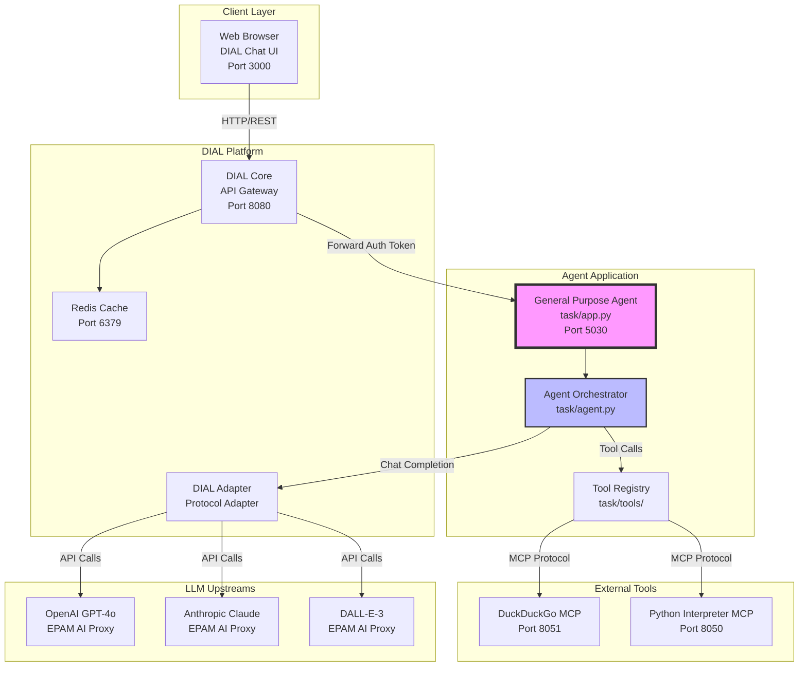

### Key Architectural Principles

1. **Separation of Concerns**: Agent (orchestration) ↔ Tools (execution) ↔ Infrastructure (DIAL/MCP)
2. **Async-First Design**: All I/O operations are async (tool execution, LLM calls, MCP communication)
3. **Fail-Safe Tool Execution**: Tool errors don't crash agent - returned as messages for LLM to handle
4. **Hidden State Management**: Full conversation history hidden from UI but preserved for agent context
5. **Per-Request Authentication**: User's API keys forwarded per-request, never stored

## Architecture Pattern

### Agent-as-Orchestrator Flow

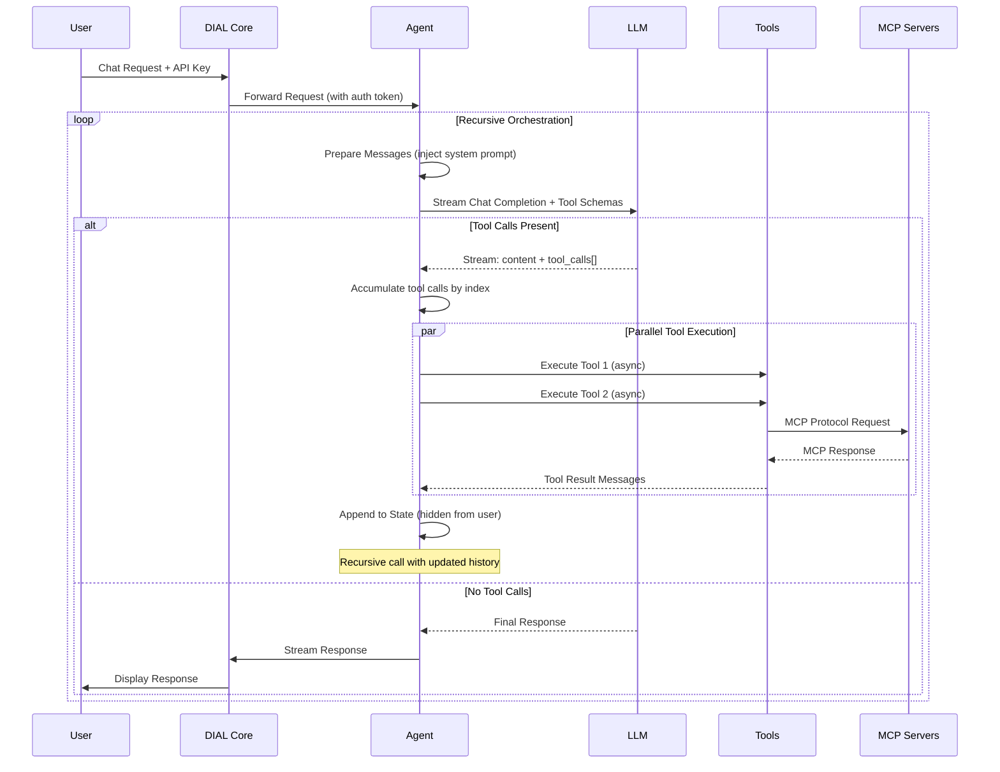

### Recursive Streaming Pattern

The agent uses a recursive approach to handle multi-turn tool interactions:

```python
async def handle_request():
    while True:
        # 1. Stream LLM response with tool schemas
        response = await llm.stream(messages, tools)
        
        # 2. Accumulate content + tool_calls
        tool_calls = accumulate_streaming_tool_calls(response)
        
        # 3. Decision point
        if not tool_calls:
            return final_response  # Base case
        
        # 4. Execute tools in parallel
        tool_results = await asyncio.gather(*[
            tool.execute(params) for tool in tool_calls
        ])
        
        # 5. Append to hidden state
        state.append(assistant_message)
        state.append(tool_results)
        
        # 6. Recurse with updated history
        messages = prepare_messages(state)
        # Continue loop...
```

**Why Recursive?**
- LLM may need multiple tool calls to complete task (e.g., extract file → analyze → generate chart)
- Each tool result provides new context for next decision
- Gracefully handles errors (tool failure → LLM sees error → tries alternative)

## System Components

### 1. Application Layer (`task/app.py`)

**Responsibility**: Entry point, tool initialization, request routing

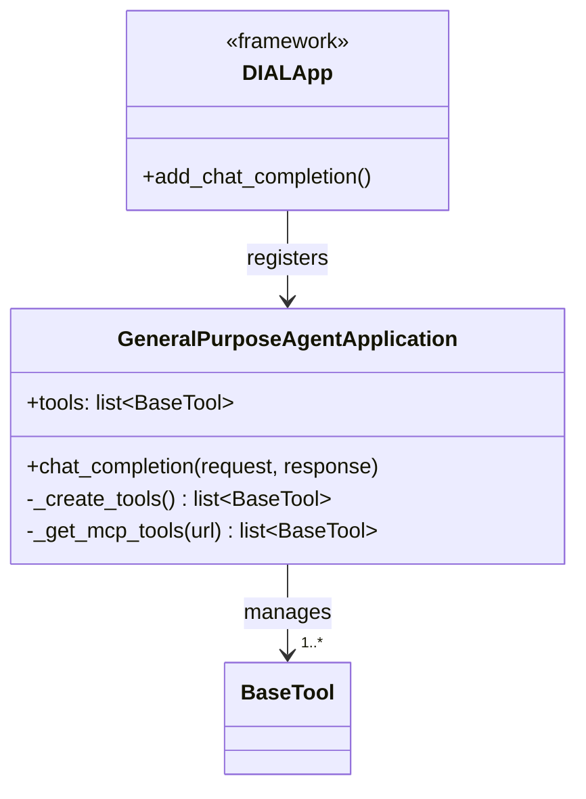

**Key Behaviors:**
- **Lazy Tool Initialization**: Tools created on first request, cached for subsequent requests
- **MCP Discovery**: Dynamically discovers tools from MCP servers via HTTP
- **DIAL Integration**: Implements `ChatCompletion` interface from `aidial-sdk`

**Initialization Sequence:**

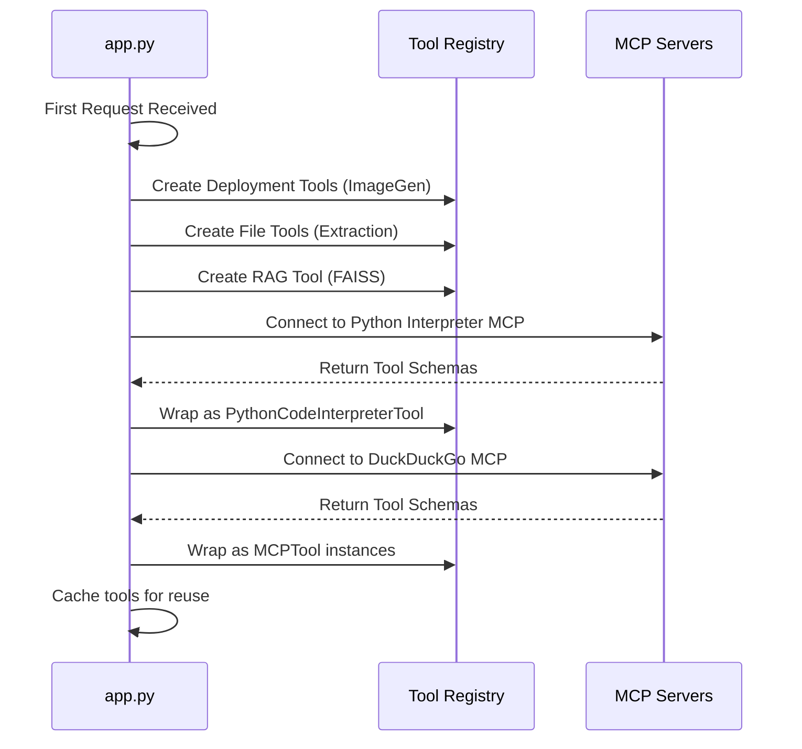

### 2. Orchestration Layer (`task/agent.py`)

**Responsibility**: LLM coordination, tool execution, state management

**Core Method: `handle_request()`**

```python
async def handle_request(deployment, choice, request, response):
    """
    Recursive orchestration loop:
    1. Prepare messages (inject system prompt + unpack state)
    2. Stream LLM response
    3. Accumulate tool_calls by index
    4. If tool_calls: execute → update state → recurse
    5. Else: return final response
    """
```

**Tool Call Accumulation Pattern** (OpenAI Streaming Spec):

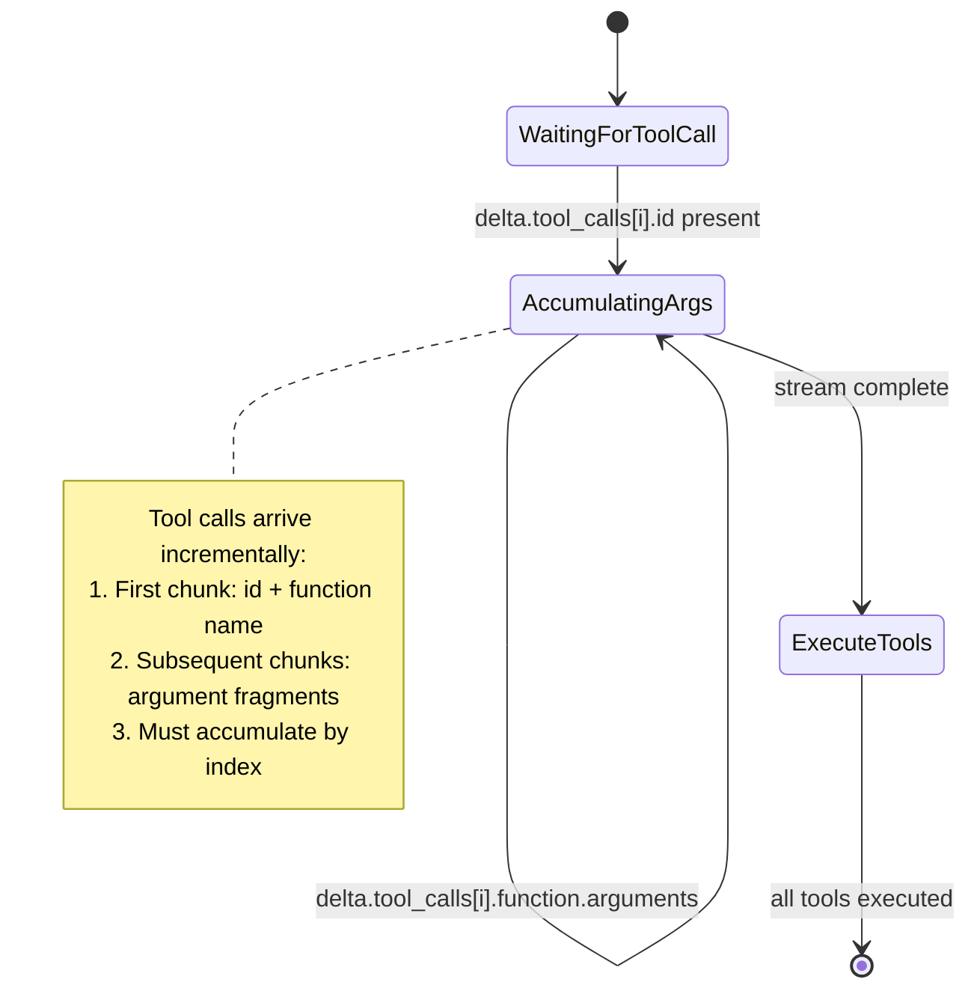

**Message Preparation Flow:**

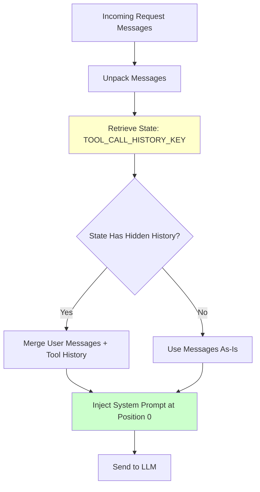

**Why Unpack Messages?**
- DIAL attachments sent as URLs, need conversion to text
- Hidden tool call history stored in `custom_content.state`
- System prompt injected per-request (security: never visible to user)

### 3. Tool Layer (`task/tools/`)

**Responsibility**: Encapsulate external capabilities, uniform interface

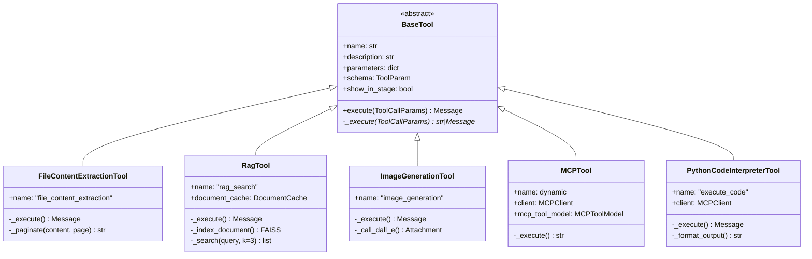

**Template Method Pattern** (`BaseTool.execute()`):

```python
async def execute(tool_call_params: ToolCallParams) -> Message:
    """Public API: wraps _execute() with error handling"""
    message = Message(role=TOOL, name=self.name, tool_call_id=...)
    try:
        result = await self._execute(tool_call_params)  # Subclass implements
        message.content = result if isinstance(result, str) else result
    except Exception as e:
        message.content = f"Error: {e}"  # Fail-safe: return error as content
    return message
```

**Why Template Method?**
- Uniform error handling across all tools
- Consistent message structure (role=TOOL, tool_call_id)
- Subclasses focus on logic, not infrastructure

### 4. MCP Integration Layer (`task/tools/mcp/`)

**Model Context Protocol** enables external tool servers.

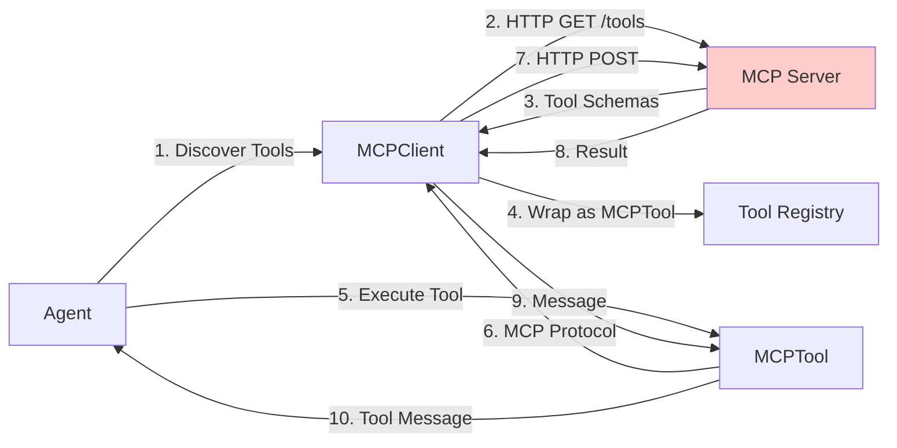

**MCPClient** (`task/tools/mcp/mcp_client.py`):
- Async context manager for connection lifecycle
- Stateless HTTP transport (no WebSocket dependency)
- Tool discovery via `/tools` endpoint
- Tool execution via `/call_tool` endpoint

**Supported MCP Servers:**
1. **DuckDuckGo Search** (`port 8051`): Web search + content fetching
2. **Python Interpreter** (`port 8050`): Jupyter kernel execution

### 5. Utility Layer (`task/utils/`)

**Modules:**

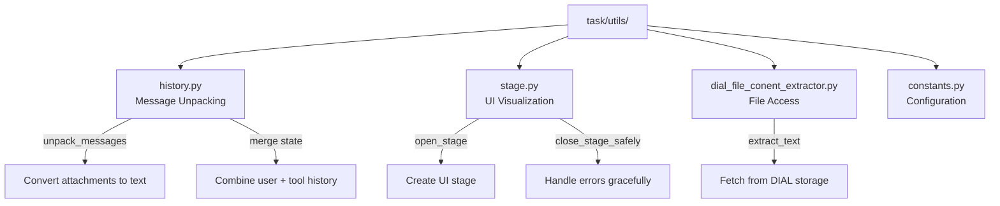

## Data Flow

### Complete Request-Response Cycle

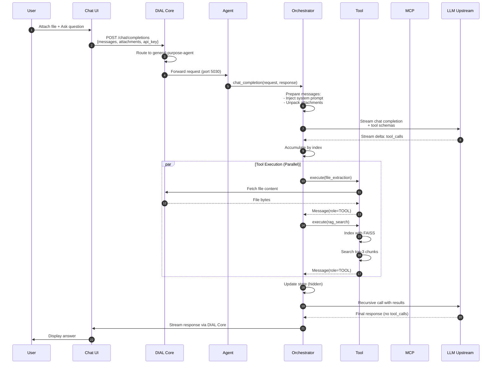

### Tool Execution Data Flow

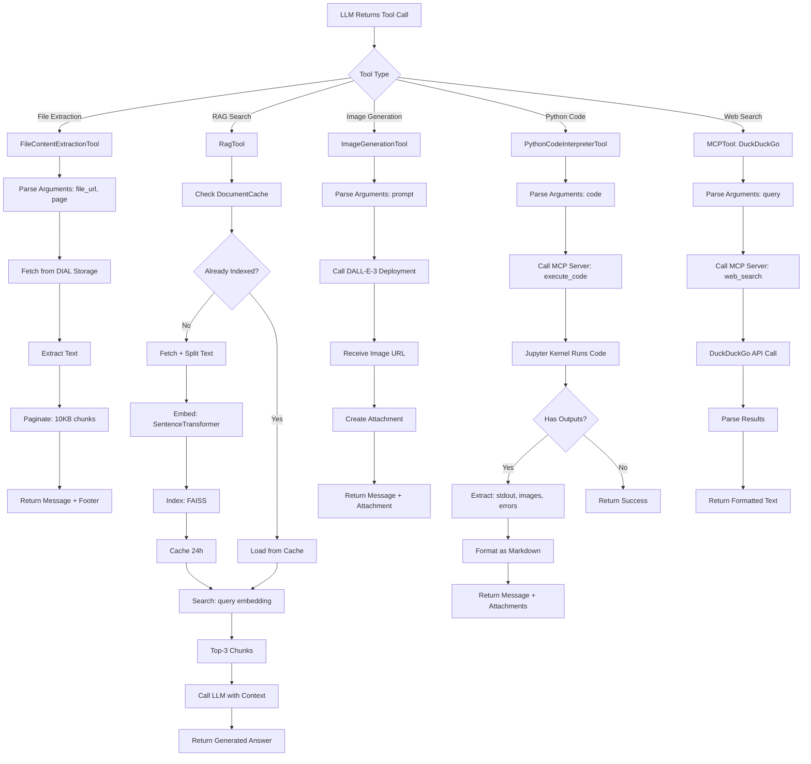

## Tool Architecture

### Tool Categories

| Category | Tools | Purpose | Technology |
|----------|-------|---------|------------|
| **Deployment** | ImageGenerationTool | Call DIAL models as tools | DALL-E-3 API |
| **File** | FileContentExtractionTool | Extract content from attachments | pdfplumber, BeautifulSoup, pandas |
| **RAG** | RagTool | Semantic search over documents | FAISS, SentenceTransformers |
| **MCP** | MCPTool (DuckDuckGo) | Web search via external server | MCP Protocol, HTTP |
| **Python** | PythonCodeInterpreterTool | Code execution, chart generation | Jupyter kernel, MCP |

### Tool Schema Format (OpenAI Function Calling)

```json
{
  "type": "function",
  "function": {
    "name": "file_content_extraction",
    "description": "Extracts text content from PDF, TXT, CSV, HTML files. Supports pagination for large files.",
    "parameters": {
      "type": "object",
      "properties": {
        "file_url": {
          "type": "string",
          "description": "URL of the file to extract content from"
        },
        "page": {
          "type": "integer",
          "description": "Page number for pagination (1-based). Omit to get first page."
        }
      },
      "required": ["file_url"]
    }
  }
}
```

### Tool Execution Parameters

All tools receive `ToolCallParams`:

```python
@dataclass
class ToolCallParams:
    tool_call: ToolCall           # Contains function name + arguments (JSON)
    stage: Stage                  # UI visualization object
    choice: Choice                # Response streaming object
    api_key: str                  # Per-request user API key
    conversation_id: str          # For caching scoped to conversation
```

**Why `ToolCallParams`?**
- Uniform interface across all tools
- Encapsulates context needed for execution
- Enables UI visualization (stages)
- Supports conversation-scoped caching

### Stage Visualization Pattern

Tools can visualize execution in DIAL Chat UI:

```python
async def _execute(self, params: ToolCallParams) -> Message:
    stage = StageProcessor.open_stage(params.choice, "File Extraction")
    stage.append_content("## Extracting content\n")
    stage.append_content(f"File: {file_url}\n")
    
    try:
        content = await extract_file(file_url)
        stage.append_content(f"✓ Extracted {len(content)} characters\n")
        return Message(content=content)
    finally:
        StageProcessor.close_stage_safely(stage)
```

**Stage Features:**
- Collapsible sections in UI
- Markdown formatting support
- Code blocks for request/response display
- Attachment previews

## State Management

### Hidden Conversation State

**Problem**: Users shouldn't see raw tool call history, but agent needs full context.

**Solution**: Store complete history in `custom_content.state[TOOL_CALL_HISTORY_KEY]`

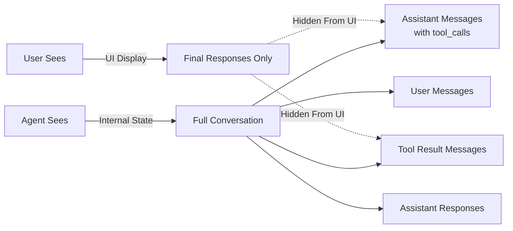

**State Structure:**

```python
state = {
    "tool_call_history": [
        # User message
        {"role": "user", "content": "Extract this file", "attachments": [...]},
        
        # Assistant with tool call (hidden from UI)
        {"role": "assistant", "content": "", "tool_calls": [
            {"id": "call_123", "function": {"name": "file_extraction", "arguments": "..."}}
        ]},
        
        # Tool result (hidden from UI)
        {"role": "tool", "content": "Extracted content...", "tool_call_id": "call_123"},
        
        # Final assistant response (visible in UI)
        {"role": "assistant", "content": "Based on the file..."}
    ]
}
```

**Security Implications:**
- System prompt never visible to user (injected per-request)
- Tool call internals hidden (prevents prompt injection via tool results)
- Per-request key forwarding (user's credentials, not shared pool)

### Document Cache (RAG)

**DocumentCache** (`task/tools/rag/document_cache.py`):
- TTL: 24 hours
- Key format: `{conversation_id}_{file_url}`
- Stores FAISS index + metadata
- Thread-safe (asyncio locks)

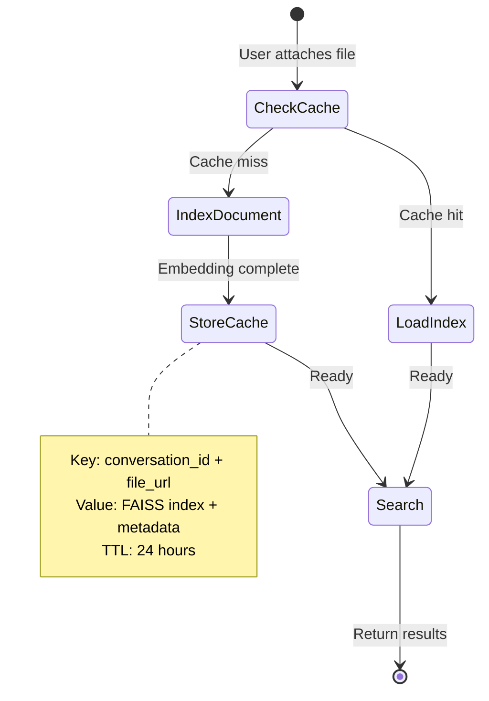

**Why Conversation-Scoped?**
- Different users may upload same file with different context
- Privacy: user A's indexed documents not accessible to user B
- Memory efficiency: automatic cleanup after 24h

## Error Handling

### Multi-Layer Error Strategy

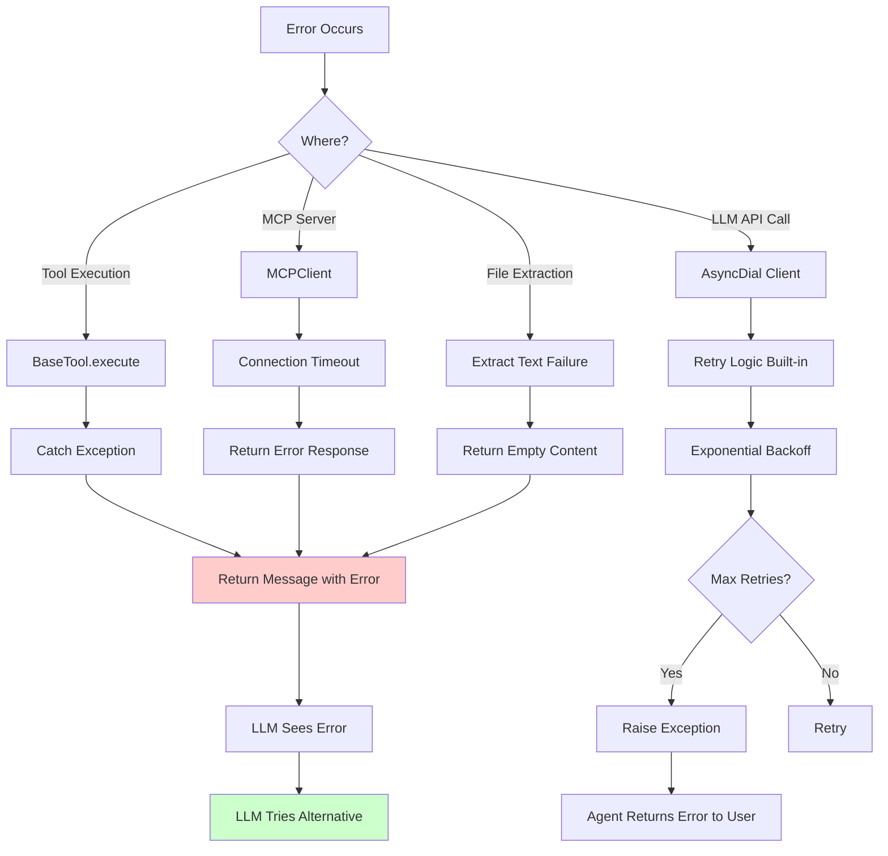

### Error Recovery Patterns

**1. Tool Error → LLM Decision**
```
User: "What's in this corrupted PDF?"
Agent → Tool: file_extraction(corrupted.pdf)
Tool → Agent: "Error: Unable to parse PDF"
Agent → LLM: (sees error in tool result)
LLM → Agent: "I encountered an error reading the PDF. It may be corrupted..."
```

**2. MCP Server Unavailable → Graceful Degradation**
```python
try:
    mcp_tools = await self._get_mcp_tools("http://localhost:8051")
except Exception as e:
    print(f"⚠️ MCP server unavailable: {e}")
    mcp_tools = []  # Continue without web search
```

**3. Pagination Error → Stop Gracefully**
```python
if page > total_pages:
    return Message(content="Error: Page number exceeds total pages")
```

### Stage Error Handling

```python
stage = StageProcessor.open_stage(choice, tool_name)
try:
    # Tool execution
    result = await complex_operation()
    stage.append_content(f"✓ Success: {result}\n")
except Exception as e:
    stage.append_content(f"✗ Error: {e}\n")
finally:
    StageProcessor.close_stage_safely(stage)  # Always close
```

## Security Model

### Per-Request API Key Forwarding

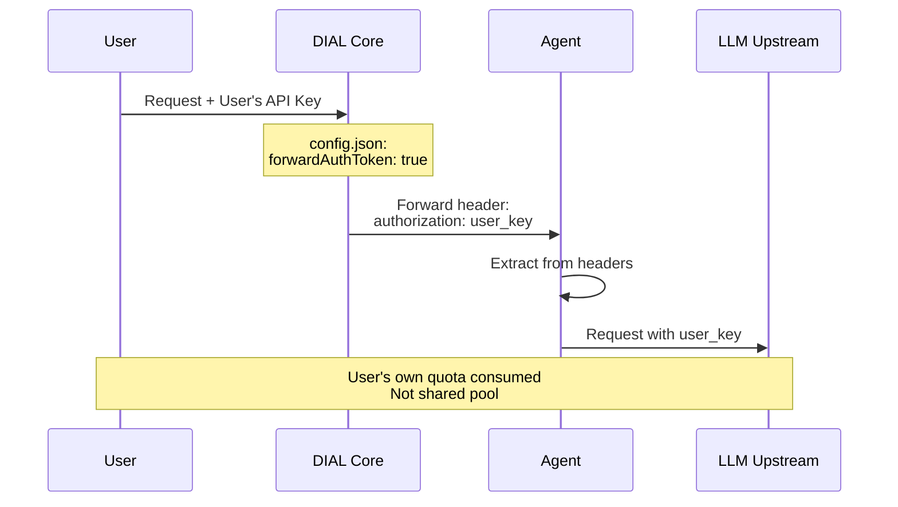

**Configuration** (`core/config.json`):
```json
{
  "applications": {
    "general-purpose-agent": {
      "forwardAuthToken": true  // Critical for security
    }
  }
}
```

**Benefits:**
- No shared API key pool (quota abuse prevention)
- User accountability (track usage per user)
- Rate limiting per user (not per agent)

### System Prompt Injection

**Problem**: If system prompt is in conversation history, users could see/manipulate it.

**Solution**: Inject on every request at position 0

```python
def _prepare_messages(self, messages):
    unpacked = unpack_messages(messages, self.state[TOOL_CALL_HISTORY_KEY])
    return [{"role": "system", "content": self.system_prompt}] + unpacked
```

**Security Properties:**
- System prompt never in client-side state
- Cannot be overridden by user messages
- Consistent across all requests

### Input Validation

**File URLs** - validated in DIAL Core (only authorized file storage URLs)
**Tool Arguments** - JSON schema validation by LLM (pydantic models)
**MCP Responses** - validated against protocol specification

## Performance Considerations

### Async Execution Patterns

**Parallel Tool Execution:**
```python
# Execute multiple tools simultaneously
tool_messages = await asyncio.gather(*[
    self._process_tool_call(tool_call, ...) for tool_call in tool_calls
])
```

**Performance Gains:**
- File extraction + web search in parallel
- Multiple web searches concurrently
- Independent tool calls don't block each other

### Caching Strategy

| Layer | Cache | TTL | Purpose |
|-------|-------|-----|---------|
| **Tools** | In-memory list | Application lifetime | Avoid re-initialization |
| **Documents** | DocumentCache | 24 hours | Reuse FAISS indexes |
| **DIAL Core** | Redis | Configurable | Rate limiting, session |

### Streaming Optimization

**Incremental Response:**
```python
async for chunk in llm_stream:
    if chunk.delta.content:
        choice.append_content(chunk.delta.content)  # Real-time to UI
```

**Benefits:**
- User sees response immediately (not waiting for complete response)
- Better perceived performance
- Can stop generation early if needed

### Memory Management

**Large File Handling:**
- Pagination: 10KB chunks (not loading entire file)
- RAG chunking: 500 chars with 50 char overlap
- FAISS CPU-optimized (no GPU required)

**MCP Connection Pooling:**
```python
async with MCPClient.create(url) as client:
    # Connection reused for multiple tool calls
    result1 = await client.call_tool("tool1", args1)
    result2 = await client.call_tool("tool2", args2)
# Auto-cleanup on exit
```

## Design Decisions

See [Architecture Decision Records](./adr/) for detailed rationale:

- [ADR-001: Agent-as-Orchestrator Pattern](./adr/ADR-001-agent-orchestrator-pattern.md)
- [ADR-002: MCP for External Tools](./adr/ADR-002-mcp-external-tools.md)
- [ADR-003: Hidden State Management](./adr/ADR-003-hidden-state-management.md)
- [ADR-004: Async-First Architecture](./adr/ADR-004-async-first-architecture.md)
- [ADR-005: Template Method for Tools](./adr/ADR-005-template-method-tools.md)

### Key Trade-offs

**Recursive vs. Loop-Based Orchestration**
- ✅ Chosen: Recursive (cleaner state management, natural async flow)
- ❌ Alternative: While loop (more imperative, harder to reason about)

**Streaming vs. Batch Tool Execution**
- ✅ Chosen: Streaming (better UX, real-time feedback)
- ❌ Alternative: Batch (simpler implementation, worse UX)

**MCP HTTP vs. WebSocket**
- ✅ Chosen: HTTP (stateless, simpler deployment, better for serverless)
- ❌ Alternative: WebSocket (lower latency, but more complex)

**FAISS vs. Vector Database**
- ✅ Chosen: FAISS in-memory (no external dependency, fast for small datasets)
- ❌ Alternative: Pinecone/Weaviate (better for large-scale, but adds complexity)

---

**Next Steps:**
- [API Reference](./api.md) - Detailed class/method documentation
- [Setup Guide](./setup.md) - Infrastructure and deployment
- [Testing Guide](./testing.md) - Validation scenarios
