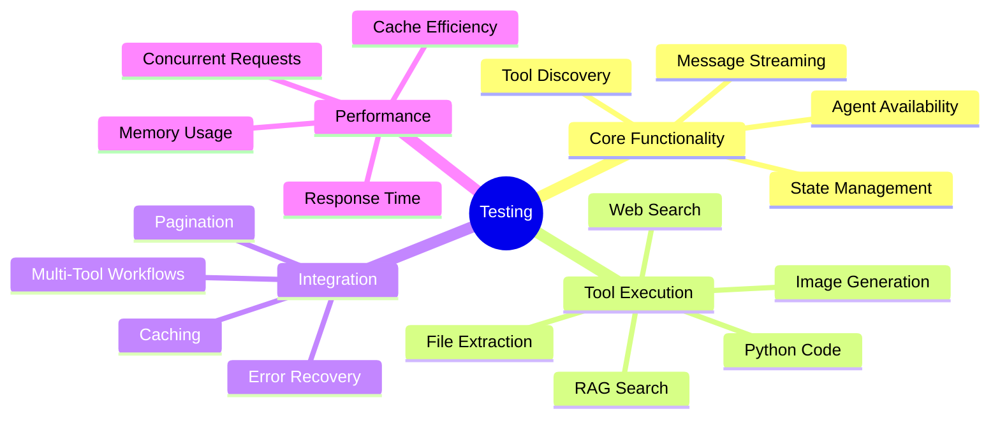

# Testing Guide

## Table of Contents

- [Overview](#overview)
- [Test Environment Setup](#test-environment-setup)
- [Core Functionality Tests](#core-functionality-tests)
- [Tool-Specific Tests](#tool-specific-tests)
- [Integration Tests](#integration-tests)
- [Performance Tests](#performance-tests)
- [Error Handling Tests](#error-handling-tests)
- [Test Data](#test-data)
- [Automated Testing](#automated-testing)

## Overview

This guide provides comprehensive test scenarios to validate the General Purpose Agent's functionality, performance, and error handling capabilities.

### Test Coverage



### Test Maturity Levels

| Level | Description | Status |
|-------|-------------|--------|
| **L1: Smoke** | Basic functionality, agent responds | ✅ Complete |
| **L2: Feature** | Each tool works independently | ✅ Complete |
| **L3: Integration** | Multi-tool workflows | ✅ Complete |
| **L4: Edge Cases** | Error handling, limits | ⚠️ Partial |
| **L5: Performance** | Load testing, optimization | ❌ TODO |
| **L6: Automated** | CI/CD integration | ❌ TODO |

---

## Test Environment Setup

### Prerequisites

```bash
# Ensure all services running
docker-compose ps  # All should show "Up"

# Verify agent running
curl http://localhost:5030/health

# Open DIAL Chat
open http://localhost:3000
```

### Test Files Location

Test files are in `tests/` directory:
- [tests/report.csv](../tests/report.csv) - Sample CSV data
- [tests/microwave_manual.txt](../tests/microwave_manual.txt) - Large text document (~50 pages)

### Setting Up Test Environment

```bash
# Activate virtual environment
source dial_general_agent/bin/activate

# Verify test files exist
ls -lh tests/
# Should show:
# report.csv
# microwave_manual.txt
```

---

## Core Functionality Tests

### Test 1: Agent Availability

**Objective:** Verify agent is accessible in DIAL Chat marketplace.

**Steps:**
1. Open http://localhost:3000
2. Click **Marketplace** icon (grid)
3. Look for "General Purpose Agent" card

**Expected Result:**
- ✅ Agent visible in marketplace
- ✅ Display name: "General Purpose Agent"
- ✅ Description mentions tools (WEB search, RAG, Python, Image Gen)
- ✅ Icon displayed

**Pass Criteria:** Agent appears and can be selected.

---

### Test 2: Basic Communication

**Objective:** Verify agent responds to simple queries.

**Query:**
```
Hi, what can you do?
```

**Expected Response:**
Agent should list available tools:
- ✅ File content extraction (PDF, TXT, CSV, HTML)
- ✅ RAG search for documents
- ✅ Web search via DuckDuckGo
- ✅ Python code execution
- ✅ Image generation via DALL-E-3

**Pass Criteria:** Response includes all 5 tool categories.

---

### Test 3: Tool Schema Discovery

**Objective:** Verify LLM receives correct tool schemas.

**Query:**
```
What parameters does the file extraction tool accept?
```

**Expected Response:**
- ✅ Mentions `file_url` parameter (required)
- ✅ Mentions `page` parameter (optional, for pagination)
- ✅ Explains pagination (10,000 characters per page)

**Pass Criteria:** Agent correctly describes tool interface.

---

### Test 4: Streaming Response

**Objective:** Verify real-time streaming works.

**Query:**
```
Tell me a story about a robot
```

**Expected Behavior:**
- ✅ Words appear incrementally (not all at once)
- ✅ No long pauses between words
- ✅ Complete story delivered

**Pass Criteria:** Response streams in real-time.

---

## Tool-Specific Tests

### File Content Extraction Tool

#### Test 5: CSV Extraction

**Objective:** Extract and analyze CSV data.

**Steps:**
1. Upload `tests/report.csv`
2. Ask: `What is the top sale for category A?`

**Expected Behavior:**
1. ✅ Agent calls `file_content_extraction_tool`
2. ✅ Stage shows "Request arguments" with file URL
3. ✅ Stage shows extracted CSV content (markdown table)
4. ✅ Agent provides answer: "1700 on 2025-10-05"

**Stage Content:**
```markdown
## Request arguments:
**File URL**: files/abc123.csv

## Response:
| Date | Category | Sale |
|------|----------|------|
| 2025-10-01 | A | 1200 |
| 2025-10-05 | A | 1700 |
...
```

**Pass Criteria:**
- Correct extraction
- Accurate answer
- Stage visualization present

---

#### Test 6: PDF Extraction with Pagination

**Objective:** Verify pagination for large documents.

**Steps:**
1. Upload `tests/microwave_manual.txt` (rename to .pdf if needed)
2. Ask: `Extract the first page of this document`

**Expected Behavior:**
1. ✅ Agent calls tool with `page=1`
2. ✅ Response includes footer: `**Page #1. Total pages: 5**` (or similar)
3. ✅ Content is ~10,000 characters
4. ✅ Agent mentions more pages available

**Pass Criteria:** Pagination footer present, agent aware of multiple pages.

---

#### Test 7: HTML Extraction

**Objective:** Extract text from HTML files.

**Steps:**
1. Create test HTML file:
```html
<!DOCTYPE html>
<html>
<body>
  <h1>Test Document</h1>
  <p>This is a paragraph with <b>bold text</b>.</p>
  <script>alert('should be removed');</script>
</body>
</html>
```
2. Upload and ask: `What's in this HTML file?`

**Expected Behavior:**
1. ✅ Extracts text content
2. ✅ Removes script tags
3. ✅ Preserves structure (headers, paragraphs)

**Pass Criteria:** Clean text extraction without scripts.

---

### RAG Search Tool

#### Test 8: Semantic Search in Large Document

**Objective:** Prefer RAG over pagination for specific queries.

**Steps:**
1. Upload `tests/microwave_manual.txt`
2. Ask: `How should I clean the plate? Use semantic search.`

**Expected Behavior:**
1. ✅ Agent calls `rag_search_tool` (not `file_content_extraction_tool`)
2. ✅ Stage shows:
   - "Indexing document" step
   - "Searching for relevant content"
   - "Generating response"
3. ✅ Response based on retrieved context (not full document)
4. ✅ Answer is accurate and specific

**Stage Content:**
```markdown
## Request arguments:
**Request**: How should I clean the plate?
**File URL**: files/manual.txt

## Indexing document
Extracting content...
Splitting into chunks (500 chars each)...
Embedding chunks...
Building FAISS index...
✓ Indexed 247 chunks

## Searching for relevant content
Query: "How should I clean the plate?"
Top 3 results:
1. [Score: 0.82] "...remove the glass plate...warm soapy water..."
2. [Score: 0.75] "...clean with soft cloth..."
3. [Score: 0.68] "...avoid abrasive cleaners..."

## Generating response
```

**Pass Criteria:**
- RAG tool called (not file extraction)
- Indexing successful
- Relevant chunks retrieved
- Accurate answer generated

---

#### Test 9: RAG Caching

**Objective:** Verify document cache reuse.

**Steps:**
1. Upload `tests/microwave_manual.txt`
2. Ask: `How do I defrost food?`
3. **Without restarting agent**, ask: `How long should I microwave popcorn?`

**Expected Behavior (First Query):**
1. ✅ Stage shows "Indexing document"
2. ✅ Indexing takes 1-2 seconds

**Expected Behavior (Second Query):**
1. ✅ Stage shows "Using cached index"
2. ✅ No indexing step (instant search)
3. ✅ Faster response time

**Pass Criteria:** Second query reuses cache, no re-indexing.

---

### Image Generation Tool

#### Test 10: Basic Image Generation

**Objective:** Generate image via DALL-E-3.

**Query:**
```
Generate a picture of a smiling cat wearing sunglasses
```

**Expected Behavior:**
1. ✅ Agent calls `image_generation_tool`
2. ✅ Stage shows:
   - Request arguments (prompt)
   - Revised prompt from DALL-E-3
   - Image preview
3. ✅ Image appears in chat as attachment
4. ✅ Image format: PNG or JPEG

**Stage Content:**
```markdown
## Request arguments:
**Prompt**: Generate a picture of a smiling cat wearing sunglasses

## Response:
**Revised Prompt**: "A photograph of a happy domestic cat wearing stylish sunglasses..."

## Generated Image:

```

**Pass Criteria:**
- Image generated successfully
- Image displayed in chat
- Stage shows all steps

---

#### Test 11: Image Generation with Context

**Objective:** Generate image based on prior conversation context.

**Conversation:**
```
User: What's the weather in Paris?
Agent: [uses web search] Currently 15°C and sunny in Paris.

User: Generate an image representing that weather
```

**Expected Behavior:**
1. ✅ Agent understands context (sunny Paris)
2. ✅ Generates appropriate image (Eiffel Tower in sunshine, etc.)
3. ✅ Image matches weather description

**Pass Criteria:** Context-aware image generation.

---

### Python Code Interpreter Tool

#### Test 12: Simple Calculation

**Objective:** Execute Python code for math.

**Query:**
```
What is the sin of 5682936329203?
```

**Expected Behavior:**
1. ✅ Agent calls `execute_code` tool
2. ✅ Stage shows Python code:
```python
import math
result = math.sin(5682936329203)
print(result)
```
3. ✅ Stage shows output: numerical result
4. ✅ Agent provides formatted answer

**Pass Criteria:** Correct calculation via Python.

---

#### Test 13: Data Analysis with Chart

**Objective:** Generate visualization from data.

**Steps:**
1. Upload `tests/report.csv`
2. Ask: `Create a bar chart showing sales by category`

**Expected Behavior:**
1. ✅ Agent calls `file_content_extraction_tool` to get data
2. ✅ Agent calls `execute_code` with matplotlib code:
```python
import matplotlib.pyplot as plt
import pandas as pd

data = {
    'Category': ['A', 'B', 'C'],
    'Sales': [1700, 1200, 900]
}
df = pd.DataFrame(data)

plt.bar(df['Category'], df['Sales'])
plt.xlabel('Category')
plt.ylabel('Sales')
plt.title('Sales by Category')
plt.savefig('chart.png')
```
3. ✅ Chart image attached to response
4. ✅ Chart displayed in chat

**Pass Criteria:**
- Multi-tool workflow (extraction → code → chart)
- Chart generated and displayed

---

#### Test 14: Stateful Execution

**Objective:** Verify kernel maintains state across executions.

**Conversation:**
```
User: Run this code: x = 42

User: Now multiply x by 2 and print the result
```

**Expected Behavior:**
1. ✅ First execution sets `x = 42`
2. ✅ Second execution accesses `x` from previous execution
3. ✅ Output: `84`

**Pass Criteria:** State preserved across tool calls.

---

### Web Search Tool (DuckDuckGo MCP)

#### Test 15: Current Information Lookup

**Objective:** Search web for current data.

**Query:**
```
What is the weather in Kyiv right now?
```

**Expected Behavior:**
1. ✅ Agent calls `duckduckgo_web_search`
2. ✅ Stage shows search query
3. ✅ Stage shows search results (snippets)
4. ✅ Agent synthesizes answer from results
5. ✅ Answer includes current temperature/conditions

**Pass Criteria:** Real-time web data retrieved and presented.

---

#### Test 16: Factual Information

**Query:**
```
Who is Arkadiy Dobkin?
```

**Expected Behavior:**
1. ✅ Agent searches web
2. ✅ Finds biographical information
3. ✅ Provides summary (EPAM founder/CEO, etc.)

**Pass Criteria:** Accurate biographical data from web.

---

## Integration Tests

### Test 17: Multi-Step Workflow

**Objective:** File → Analysis → Visualization

**Steps:**
1. Upload `tests/report.csv`
2. Ask: `Analyze this sales data and create a visualization showing trends over time`

**Expected Workflow:**
1. ✅ Extract file content
2. ✅ Analyze data (Python)
3. ✅ Generate time series chart
4. ✅ Return chart as attachment

**Pass Criteria:** Complete end-to-end workflow.

---

### Test 18: Web Search → Image Generation

**Query:**
```
Search for the Eiffel Tower and generate an artistic image of it
```

**Expected Workflow:**
1. ✅ Search web for Eiffel Tower info
2. ✅ Use search results to inform image prompt
3. ✅ Generate image with context

**Pass Criteria:** Tools chained logically.

---

### Test 19: File + RAG + Code

**Objective:** Complex document analysis.

**Steps:**
1. Upload `tests/microwave_manual.txt`
2. Ask: `Find all temperature settings mentioned in the manual and create a table`

**Expected Workflow:**
1. ✅ RAG search for temperature-related content
2. ✅ Python code to parse and format table
3. ✅ Return formatted markdown table

**Pass Criteria:** Multi-tool coordination.

---

## Performance Tests

### Test 20: Response Time Baseline

**Objective:** Measure typical response times.

**Test Cases:**

| Query Type | Expected Time | Acceptable Range |
|------------|---------------|------------------|
| Simple question (no tools) | <2s | 0.5-3s |
| File extraction (CSV, 10KB) | <3s | 1-5s |
| RAG search (first query, 50 pages) | <5s | 3-8s |
| RAG search (cached) | <2s | 1-3s |
| Image generation | <10s | 5-15s |
| Python execution (simple) | <2s | 1-4s |
| Web search | <3s | 2-5s |

**Measurement Method:**
```bash
# Using curl with timing
time curl -X POST http://localhost:5030/openai/deployments/general-purpose-agent/chat/completions \
  -H "Content-Type: application/json" \
  -d '{"messages": [{"role": "user", "content": "What can you do?"}]}'
```

**Pass Criteria:** 90% of requests within acceptable range.

---

### Test 21: Concurrent Requests

**Objective:** Verify agent handles multiple simultaneous users.

**Setup:**
```bash
# Run 5 concurrent requests
for i in {1..5}; do
  curl -X POST http://localhost:5030/... &
done
wait
```

**Expected Behavior:**
- ✅ All requests complete successfully
- ✅ No request fails or times out
- ✅ Response times remain reasonable

**Pass Criteria:** All requests succeed, no crashes.

---

### Test 22: Memory Usage

**Objective:** Monitor memory consumption.

**Measurement:**
```bash
# Check agent process memory
ps aux | grep "python -m task.app"

# Check Docker container memory
docker stats --no-stream
```

**Expected Metrics:**
- Agent process: <500MB baseline
- With RAG indexing: +200MB per large document (temporary)
- After garbage collection: returns to baseline

**Pass Criteria:** No memory leaks, stable usage.

---

## Error Handling Tests

### Test 23: Invalid File Type

**Steps:**
1. Upload `.exe` file (not supported)
2. Ask: `Extract this file`

**Expected Behavior:**
1. ✅ Agent attempts extraction
2. ✅ Tool returns error message
3. ✅ Agent explains file type not supported
4. ✅ No crash or exception visible to user

**Pass Criteria:** Graceful error handling.

---

### Test 24: Malformed Tool Arguments

**Objective:** LLM provides invalid parameters.

**Scenario:** Agent calls tool with wrong argument types.

**Expected Behavior:**
1. ✅ Tool validation catches error
2. ✅ Returns error message to LLM
3. ✅ LLM retries with correct arguments OR explains limitation

**Pass Criteria:** No unhandled exceptions.

---

### Test 25: MCP Server Unavailable

**Steps:**
1. Stop DuckDuckGo MCP:
```bash
docker-compose stop ddg-search
```
2. Ask: `What's the weather in London?`

**Expected Behavior:**
1. ✅ Agent attempts web search
2. ✅ Tool returns error (MCP unreachable)
3. ✅ Agent explains search unavailable
4. ✅ Suggests alternatives if possible

**Cleanup:**
```bash
docker-compose start ddg-search
```

**Pass Criteria:** Graceful degradation.

---

### Test 26: Large File Handling

**Objective:** Verify pagination for very large files.

**Steps:**
1. Create large text file (>50KB):
```bash
yes "Sample text line. " | head -n 5000 > large_file.txt
```
2. Upload and ask: `Summarize this file`

**Expected Behavior:**
1. ✅ Agent uses pagination or RAG (not loading entire file at once)
2. ✅ No memory errors
3. ✅ Reasonable response time

**Pass Criteria:** Handles large files without crashing.

---

### Test 27: Infinite Loop Prevention

**Objective:** Ensure agent doesn't loop indefinitely.

**Query:**
```
Keep generating random numbers until you find 123456789
```

**Expected Behavior:**
1. ✅ Agent generates some numbers
2. ✅ Stops after reasonable attempts
3. ✅ Explains can't guarantee finding specific number

**Pass Criteria:** No infinite loops, agent self-limits.

---

## Test Data

### Sample CSV (tests/report.csv)

```csv
Date,Category,Sale
2025-10-01,A,1200
2025-10-02,B,900
2025-10-03,C,1100
2025-10-04,A,1500
2025-10-05,A,1700
2025-10-06,B,1200
2025-10-07,C,800
```

### Sample Manual Excerpt (tests/microwave_manual.txt)

```
MICROWAVE OVEN USER MANUAL

CLEANING AND MAINTENANCE

Glass Plate Cleaning:
Remove the glass plate from the microwave. Wash with warm soapy water...
[... continues for 50 pages]
```

---

## Automated Testing

### TODO: Unit Tests

**Framework**: pytest

**Test Structure:**
```python
# tests/test_tools.py
import pytest
from task.tools.files.file_content_extraction_tool import FileContentExtractionTool

@pytest.mark.asyncio
async def test_file_extraction():
    tool = FileContentExtractionTool(endpoint="http://localhost:8080")
    # ... test implementation
```

### TODO: Integration Tests

**Framework**: pytest + DIAL SDK test utils

**Test Structure:**
```python
# tests/test_agent_integration.py
@pytest.mark.asyncio
async def test_agent_file_extraction_flow():
    # Setup: upload file, create request
    # Execute: call agent
    # Assert: verify tool calls, response content
```

### TODO: CI/CD Pipeline

**GitHub Actions Workflow:**
```yaml
name: Test Agent

on: [push, pull_request]

jobs:
  test:
    runs-on: ubuntu-latest
    steps:
      - uses: actions/checkout@v2
      - name: Setup Python
        uses: actions/setup-python@v2
        with:
          python-version: 3.12
      - name: Install dependencies
        run: pip install -r requirements.txt
      - name: Run tests
        run: pytest tests/
```

---

**Next Steps:**
- [Setup Guide](./setup.md) - Environment configuration
- [API Reference](./api.md) - Integration details
- [Architecture](./architecture.md) - System design
